# Struts2+Spring3+Hibernate4+JavaEE6 配置

> 作者 [qyvlik](http://blog.qyvlik.space)

> Struts2, Spring3, Hibernate4, JavaEE6, JDK 7, Tomcat8, MyEclipse 2014, MySQL 5, DBCP

本文参照自 [使用Maven搭建Struts2+Spring3+Hibernate4的整合开发环境](http://www.cnblogs.com/xdp-gacl/p/4239501.html)。不过有些许不同。

## 新建 Maven 工程

1. 点击 File -> Web Project

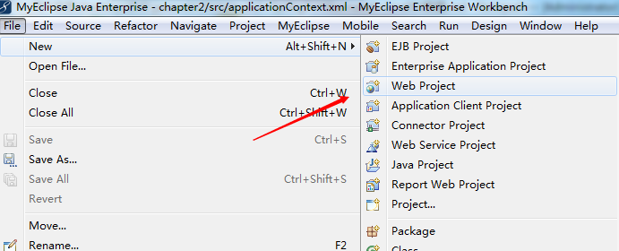

2. 勾选 `Add maven support`，然后点击 `Next >` 进行下一步配置。

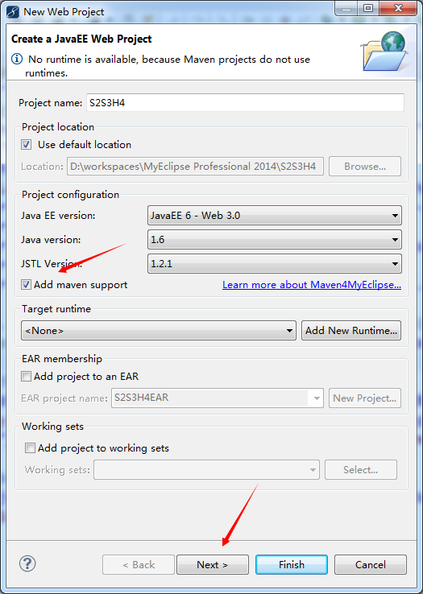

3. 这一步是提示源码文件路径，点击 `Next >` 进行下一步。

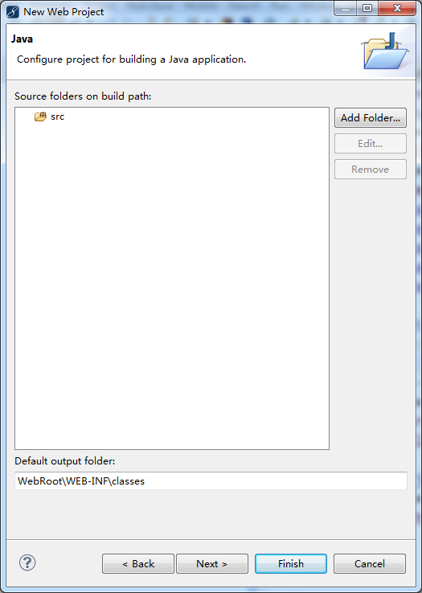

4. 这一步是展示 `Web Module`，点击 `Next >` 进行下一步。

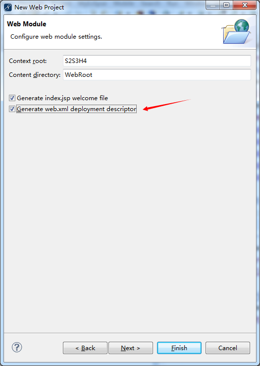

5. 这一步生成项目的 Maven 支持。 `Group Id` 一般为**公司域名**+**项目名称**（没有公司域名，随意写一个域名。），记得勾选 `Standard Maven JEE project structure`。（才可以生成 `src/main` 等四个目录）。然后点击 `Finished`。

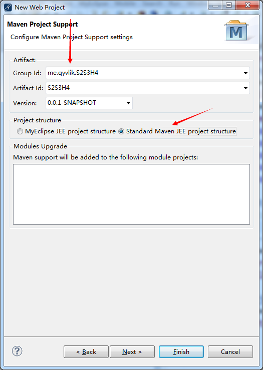

6. 配布 Maven。记得修改 Maven 默认的 JDK 版本，这样才可以在其他机子上运行。

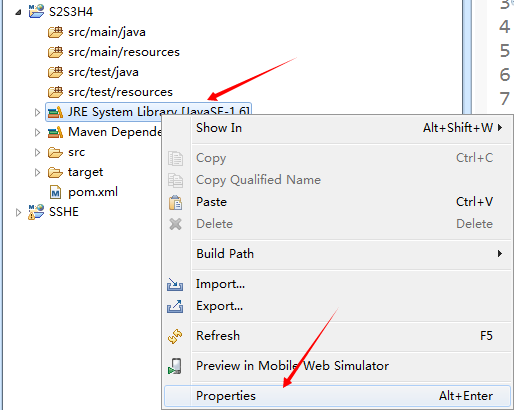

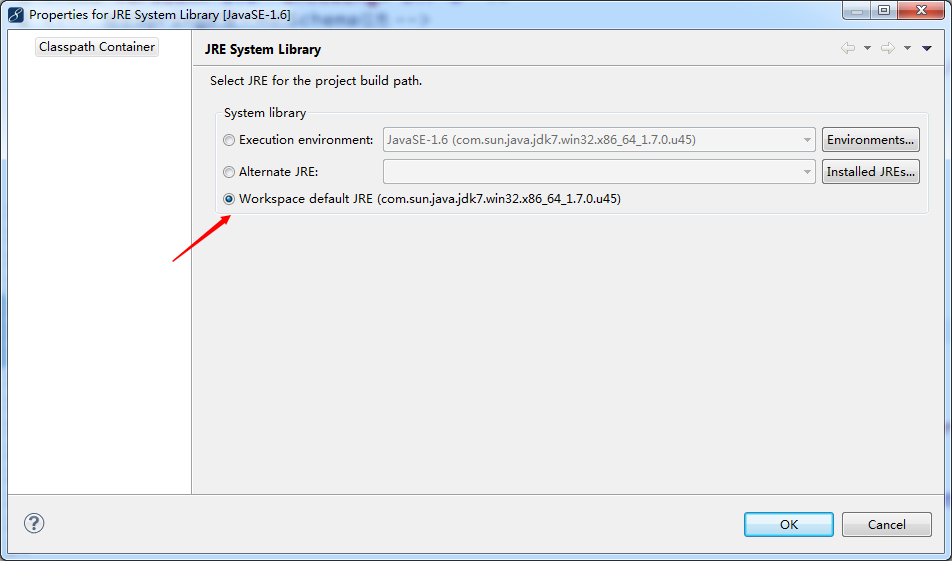

至此，一个 Maven 项目构建完毕，接下来就要使用 `pom.xml` 解决依赖问题了。

## 在 Maven 中搭建 Spring3 开发环境。

### 下载 Sping3 开发包

直接在 `pom.xml` 文件写入 Sping3 的依赖。Maven 会自动下载这些 jar。

```
		<!-- spring3 -->
		<dependency>
			<groupId>org.springframework</groupId>
			<artifactId>spring-core</artifactId>
			<version>3.1.2.RELEASE</version>
		</dependency>
		<dependency>
			<groupId>org.springframework</groupId>
			<artifactId>spring-context</artifactId>
			<version>3.1.2.RELEASE</version>
		</dependency>
		<dependency>
			<groupId>org.springframework</groupId>
			<artifactId>spring-jdbc</artifactId>
			<version>3.1.2.RELEASE</version>
		</dependency>
		<dependency>
			<groupId>org.springframework</groupId>
			<artifactId>spring-beans</artifactId>
			<version>3.1.2.RELEASE</version>
		</dependency>
		<dependency>
			<groupId>org.springframework</groupId>
			<artifactId>spring-web</artifactId>
			<version>3.1.2.RELEASE</version>
		</dependency>
		<dependency>
			<groupId>org.springframework</groupId>
			<artifactId>spring-expression</artifactId>
			<version>3.1.2.RELEASE</version>
		</dependency>
		<dependency>
			<groupId>org.springframework</groupId>
			<artifactId>spring-orm</artifactId>
			<version>3.1.2.RELEASE</version>
		</dependency>
		<!-- spring3 -->
```

### 编写 Spring3 的配置文件

在 `src/main/resources` 目录下创建一个 `spring.xml` 文件。`spring.xml` 文件一般负责将类指定为 `bean`。

如下图：

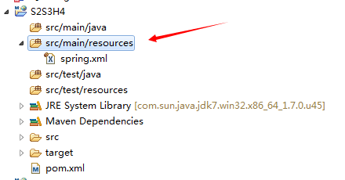

`spring.xml` 文件内容如下：

```
<?xml version="1.0" encoding="UTF-8"?>
<beans xmlns="http://www.springframework.org/schema/beans" 
xmlns:xsi="http://www.w3.org/2001/XMLSchema-instance" 
xmlns:context="http://www.springframework.org/schema/context" 
xsi:schemaLocation="http://www.springframework.org/schema/beans 
http://www.springframework.org/schema/beans/spring-beans-3.0.xsd 
http://www.springframework.org/schema/context 
http://www.springframework.org/schema/context/spring-context-3.0.xsd
">

    <!-- 引入属性文件,config.properties位于src/main/resources目录下 -->
    <context:property-placeholder location="classpath:config.properties" />

    <!-- 自动扫描dao和service包(自动注入) -->
    <context:component-scan base-package="me.qyvlik.dao,me.qyvlik.service" />
    
</beans>
```

然后再在 `src/main/resources` 下新建一个 `config.properties` 文件。保存的是数据库连接的信息和密码。现在为空，等接下来整合 `Hibernate` 时再写。

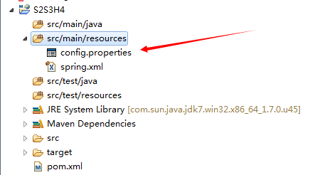

### 为 Spring3 编写单元测试

#### 为项目添加 JUnit 包

直接在 `pom.xml` 文件中添加如下依赖：

```
		<!-- Junit -->
		<dependency>
			<groupId>junit</groupId>
			<artifactId>junit</artifactId>
			<version>4.12</version>
			<scope>test</scope>
		</dependency>
		<!-- Junit -->
```

`<scope>test</scope>` 这里的 `test` 表示测试时编译 `src/main/test` 文件夹中的文件，等发布的时候不编译。

#### 新建包和类

在 `src/main/java` 中新建 `me.qyvlik.service` 包，添加一个 `UserServiceI` 接口：

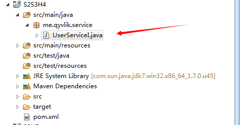

代码如下：

```
package me.qyvlik.service;

public interface UserServiceI {
	  void test();
}
```

然后再在 `src/main/java` 中创建 `me.qyvlik.service.impl` 包，新建 `UserServiceImpl` 实现类：

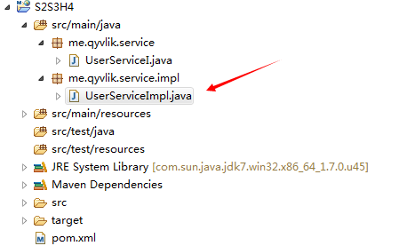

代码如下：

```
package me.qyvlik.service.impl;

import org.springframework.stereotype.Service;

import me.qyvlik.service.UserServiceI;

@Service("userService")
public class UserServiceImpl implements UserServiceI {

	@Override
	public void test() {
		System.out.println("Hello Spring!");
	}
}
```

然后编写测试类，在 `src/test/java` 中创建 `me.qyvlik.test`，新建 `TestSpring` 类：

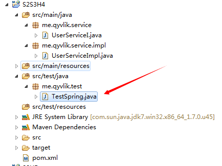

代码如下：

```
package me.qyvlik.test;

import me.qyvlik.service.UserServiceI;

import org.junit.Test;
import org.springframework.context.ApplicationContext;
import org.springframework.context.support.ClassPathXmlApplicationContext;

public class TestSpring {

	@Test
	public void test() {
		// 通过spring.xml配置文件创建Spring的应用程序上下文环境
		ApplicationContext ac = new ClassPathXmlApplicationContext(
				"classpath:spring.xml");
		// 从Spring的IOC容器中获取bean对象
		
		UserServiceI userService = (UserServiceI) ac.getBean("userService");
		// 执行测试方法
		userService.test();
	}
}
```

`JUnit Test` 运行，结果如下：


#### 在 web.xml 中添加 `Spring` 监听器

```
	<!-- Spring监听器 -->
	<listener>
		<listener-class>org.springframework.web.context.ContextLoaderListener</listener-class>
	</listener>
	<!-- Spring监听器 -->

	<!-- Spring配置文件位置 -->
	<context-param>
		<param-name>contextConfigLocation</param-name>
		<param-value>classpath:spring.xml</param-value>
	</context-param>
	<!-- Spring配置文件位置 -->
```

先执行 `Maven Install` 然后发布到 `Tomcat` 中。

对项目右键弹出菜单，选中 `Run As` -> `MyEclipse Service Application` 如下图：

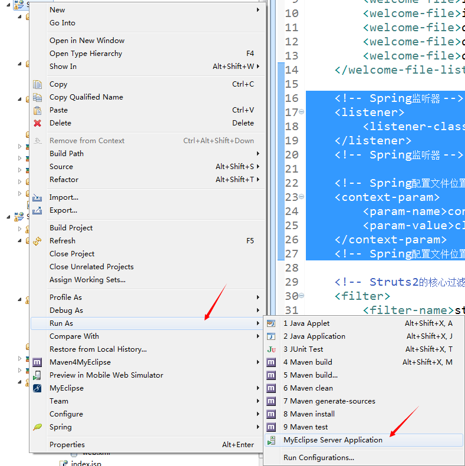

我选择了 `Tomcat 8.0`，（如果没有 8.0，7.0 应该也可以）。

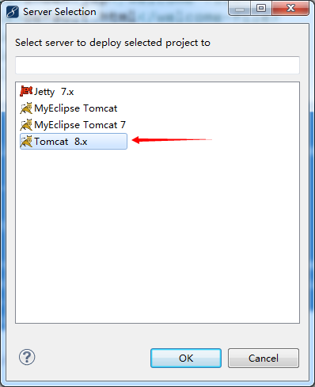

然后访问 http://localhost:8080/S2S3H4/。

如下发布成功：


> 如果发布后访问为 404 的，请先执行 `Maven Install` 再发布。或者检查 Tomcat 部署项目中是否已经加载。

## 搭建 Struts2 并整合 Spring3

### 下载 Struts2 开发包

下载 Struts2 开发包，在 `pom.xml` 中写入：

```
		<!-- Struts2 -->
		<!-- Struts2的核心包 -->
		<dependency>
			<groupId>org.apache.struts</groupId>
			<artifactId>struts2-core</artifactId>
			<version>2.3.16</version>
			<!-- 这里的 exclusions 是排除包，因为 Struts2中有javassist，Hibernate中也有javassist, 
				所以如果要整合Hibernate，一定要排除掉Struts2中的javassist，否则就冲突了。 -->
			<exclusions>
				<exclusion>
					<groupId>javassist</groupId>
					<artifactId>javassist</artifactId>
				</exclusion>
			</exclusions>
		</dependency>

		<!-- convention-plugin插件，使用了这个插件之后，就可以采用注解的方式配置Action -->
		<dependency>
			<groupId>org.apache.struts</groupId>
			<artifactId>struts2-convention-plugin</artifactId>
			<version>2.3.20</version>
		</dependency>

		<!--config-browser-plugin插件，使用了这个插件之后，就可以很方便的浏览项目中的所有action及其与 jsp view的映射 -->
		<dependency>
			<groupId>org.apache.struts</groupId>
			<artifactId>struts2-config-browser-plugin</artifactId>
			<version>2.3.20</version>
		</dependency>

		<!-- Struts2和Spring整合插件 -->
		<dependency>
			<groupId>org.apache.struts</groupId>
			<artifactId>struts2-spring-plugin</artifactId>
			<version>2.3.4.1</version>
		</dependency>
		<!-- Struts2 -->
```

> **注意**：后续集成 `Hibernate` 时一定要排除掉 `Struts2` 中的 `javassist`。

### 编写 struts.xml 配置文件

在 `src/main/resources` 目录下创建一个 `struts.xml` 文件，内容如下：

```
<?xml version="1.0" encoding="UTF-8"?>
<!DOCTYPE struts PUBLIC "-//Apache Software Foundation//DTD Struts Configuration 2.3//EN" "http://struts.apache.org/dtds/struts-2.3.dtd">
<struts>

    <!-- 指定由spring负责action对象的创建 -->
    <constant name="struts.objectFactory" value="spring" />
    <!-- 所有匹配*.action的请求都由struts2处理 -->
    <constant name="struts.action.extension" value="action" />
    <!-- 是否启用开发模式(开发时设置为true,发布到生产环境后设置为false) -->
    <constant name="struts.devMode" value="true" />
    <!-- struts配置文件改动后，是否重新加载(开发时设置为true,发布到生产环境后设置为false) -->
    <constant name="struts.configuration.xml.reload" value="true" />
    <!-- 设置浏览器是否缓存静态内容(开发时设置为false,发布到生产环境后设置为true) -->
    <constant name="struts.serve.static.browserCache" value="false" />
    <!-- 请求参数的编码方式 -->
    <constant name="struts.i18n.encoding" value="utf-8" />
    <!-- 每次HTTP请求系统都重新加载资源文件，有助于开发(开发时设置为true,发布到生产环境后设置为false) -->
    <constant name="struts.i18n.reload" value="true" />
    <!-- 文件上传最大值 -->
    <constant name="struts.multipart.maxSize" value="104857600" />
    <!-- 让struts2支持动态方法调用,使用叹号访问方法 -->
    <constant name="struts.enable.DynamicMethodInvocation" value="true" />
    <!-- Action名称中是否还是用斜线 -->
    <constant name="struts.enable.SlashesInActionNames" value="false" />
    <!-- 允许标签中使用表达式语法 -->
    <constant name="struts.tag.altSyntax" value="true" />
    <!-- 对于WebLogic,Orion,OC4J此属性应该设置成true -->
    <constant name="struts.dispatcher.parametersWorkaround" value="false" />

    <package name="basePackage" extends="struts-default">


    </package>

</struts>
```

### 在 `web.xml` 中配置 Struts2 过滤器

```
	<!-- Struts2的核心过滤器配置 -->
	<filter>
		<filter-name>struts2</filter-name>
		<filter-class>org.apache.struts2.dispatcher.ng.filter.StrutsPrepareAndExecuteFilter</filter-class>
	</filter>
	<!-- Struts2的核心过滤器配置 -->

	<!-- Struts2过滤器拦截所有的.action请求 -->
	<filter-mapping>
		<filter-name>struts2</filter-name>
		<url-pattern>*.action</url-pattern>
	</filter-mapping>
	<!-- Struts2过滤器拦截所有的.action请求 -->
```

#### 编写测试类

在 `src/main/java` 中创建 `me.qyvlik.action` 包，在包中编写一个 `TestAction` 类，内容如下：

```
package me.qyvlik.action;


import me.qyvlik.service.UserServiceI;

import org.apache.struts2.convention.annotation.Action;
import org.apache.struts2.convention.annotation.Namespace;
import org.apache.struts2.convention.annotation.ParentPackage;
import org.springframework.beans.factory.annotation.Autowired;

@ParentPackage("basePackage")
@Action(value="strust2Test")
//使用convention-plugin插件提供的@Action注解将一个普通java类标注为一个可以处理用户请求的Action，Action的名字为struts2Test
@Namespace("/")//使用convention-plugin插件提供的@Namespace注解为这个Action指定一个命名空间
public class TestAction {
    
    /**
     * 注入userService
     */
    @Autowired
    private UserServiceI userService;

    /**
     * http://localhost:8080/S2S3H4/strust2Test!test.action
     * MethodName: test
     * Description: 
     * @author xudp
     */
    public void test(){
        System.out.println("进入TestAction");
        userService.test();
    }
}
```

> 发布不成？`Maven Clear` 然后 `Maven Install`，否则就将项目移除后再重新载入。

## 搭建 Hibernate4 开发环境并整合 Spring3

### 下载 Hibernate4 开发包

下载 Hibernate4 开发包，MySQL 连接包，数据库连接池。

> 这里使用dbcp，如果测试失败，记得更换为其他的连接包。

在 `pom.xml` 中写入：

```
		<!-- hibernate4 -->
		<dependency>
			<groupId>org.hibernate</groupId>
			<artifactId>hibernate-core</artifactId>
			<version>4.1.7.Final</version>
		</dependency>
		<!-- hibernate4 -->

		<!-- mysql驱动包 -->
		<dependency>
			<groupId>mysql</groupId>
			<artifactId>mysql-connector-java</artifactId>
			<version>5.1.34</version>
		</dependency>
		<!-- mysql驱动包 -->

		<!-- dbcp -->
		<dependency>
			<groupId>commons-dbcp</groupId>
			<artifactId>commons-dbcp</artifactId>
			<version>1.4</version>
		</dependency>
		<!-- dbcp -->
```

> **注意**：后续集成 `Hibernate` 时一定要排除掉 `Struts2` 中的 `javassist`。

### 添加 aspectjweaver 包

使用 Spring 的 AOP 时需要使用到 aspectjweaver 包。

在 `pom.xml` 中写入：

```
		<!-- aspectjweaver包 -->
		<dependency>
			<groupId>org.aspectj</groupId>
			<artifactId>aspectjweaver</artifactId>
			<version>1.8.5</version>
		</dependency>
		<!-- aspectjweaver包 -->
```

### 编写连接数据库的配置信息

还记得 `config.properties` 吗，现在写入链接数据库的信息和密码吧。

```
hibernate.dialect=org.hibernate.dialect.MySQLDialect
driverClassName=com.mysql.jdbc.Driver
validationQuery=SELECT 1
jdbc_url=jdbc:mysql://localhost:3306/test?useUnicode=true&characterEncoding=UTF-8&zeroDateTimeBehavior=convertToNull
jdbc_username=root
jdbc_password=root

hibernate.hbm2ddl.auto=update
hibernate.show_sql=true
hibernate.format_sql=true
```

> 记得修改数据库用户和密码，这里指定数据库默认的 `test`。在下文的 `User` 注解参数 schema 为数据库名

### 编写 Hibernate 与 Spring 整合的配置文件

在 `src/main/resources` 目录下新建一个 `spring-hibernate.xml` 文件，写入如下文件：

```
<?xml version="1.0" encoding="UTF-8"?>
<beans xmlns="http://www.springframework.org/schema/beans"
	xmlns:xsi="http://www.w3.org/2001/XMLSchema-instance" xmlns:tx="http://www.springframework.org/schema/tx"
	xmlns:aop="http://www.springframework.org/schema/aop"
	xsi:schemaLocation="
http://www.springframework.org/schema/beans 
http://www.springframework.org/schema/beans/spring-beans-3.0.xsd 
http://www.springframework.org/schema/tx 
http://www.springframework.org/schema/tx/spring-tx-3.0.xsd
http://www.springframework.org/schema/aop 
http://www.springframework.org/schema/aop/spring-aop-3.0.xsd
">

	<!-- JNDI方式配置数据源 -->
	<!-- <bean id="dataSource" class="org.springframework.jndi.JndiObjectFactoryBean"> 
		<property name="jndiName" value="${jndiName}"></property> </bean> -->

	<!-- 定义一个使用 DBCP 实现的数据源 -->
	<bean name="dataSource" class="org.apache.commons.dbcp.BasicDataSource" destroy-method="close">
		<property name="url" value="${jdbc_url}" />
		<property name="username" value="${jdbc_username}" />
		<property name="password" value="${jdbc_password}" />
	</bean>

	<!-- 配置hibernate session工厂 -->
	<bean id="sessionFactory"
		class="org.springframework.orm.hibernate4.LocalSessionFactoryBean">
		<property name="dataSource" ref="dataSource" />
		<property name="hibernateProperties">
			<props>
				<!-- web项目启动时是否更新表结构 -->
				<prop key="hibernate.hbm2ddl.auto">${hibernate.hbm2ddl.auto}</prop>
				<!-- 系统使用的数据库方言，也就是使用的数据库类型 -->
				<prop key="hibernate.dialect">${hibernate.dialect}</prop>
				<!-- 是否打印Hibernate生成的SQL到控制台 -->
				<prop key="hibernate.show_sql">${hibernate.show_sql}</prop>
				<!-- 是否格式化打印出来的SQL -->
				<prop key="hibernate.format_sql">${hibernate.format_sql}</prop>
			</props>
		</property>

		<!-- 自动扫描注解方式配置的hibernate类文件 -->
		<property name="packagesToScan">
			<list>
				<value>me.gacl.model</value>
			</list>
		</property>

		<!-- 自动扫描hbm方式配置的hibernate文件和.hbm文件 -->
		<!-- <property name="mappingDirectoryLocations"> <list> <value>classpath:me/gacl/model/hbm</value> 
			</list> </property> -->
	</bean>

	<!-- 配置事务管理器 -->
	<bean name="transactionManager"
		class="org.springframework.orm.hibernate4.HibernateTransactionManager">
		<property name="sessionFactory" ref="sessionFactory"></property>
	</bean>

	<!-- 注解方式配置事物 -->
	<!-- <tx:annotation-driven transaction-manager="transactionManager" /> -->

	<!-- 拦截器方式配置事物 -->
	<tx:advice id="transactionAdvice" transaction-manager="transactionManager">
		<tx:attributes>
			<!-- 以如下关键字开头的方法使用事物 -->
			<tx:method name="add*" />
			<tx:method name="save*" />
			<tx:method name="update*" />
			<tx:method name="modify*" />
			<tx:method name="edit*" />
			<tx:method name="delete*" />
			<tx:method name="remove*" />
			<tx:method name="repair" />
			<tx:method name="deleteAndRepair" />
			<!-- 以如下关键字开头的方法不使用事物 -->
			<tx:method name="get*" propagation="SUPPORTS" />
			<tx:method name="find*" propagation="SUPPORTS" />
			<tx:method name="load*" propagation="SUPPORTS" />
			<tx:method name="search*" propagation="SUPPORTS" />
			<tx:method name="datagrid*" propagation="SUPPORTS" />
			<!-- 其他方法不使用事物 -->
			<tx:method name="*" propagation="SUPPORTS" />
		</tx:attributes>
	</tx:advice>
	<!-- 切面，将事物用在哪些对象上 -->
	<aop:config>
		<aop:pointcut id="transactionPointcut"
			expression="execution(* me.gacl.service..*Impl.*(..))" />
		<aop:advisor pointcut-ref="transactionPointcut"
			advice-ref="transactionAdvice" />
	</aop:config>

</beans>
```

> **注意**：这里是使用 DBCP 作为数据源的连接池。如果更换了连接池，记得修改。

### 编写测试代码

1. 在 `src/main/java` 中创建 `me.qyvlik.model` 包，在包中编写一个 `User` 类，写入如下内容：

```
package me.qyvlik.model;

import java.util.Date;

import javax.persistence.Column;
import javax.persistence.Entity;
import javax.persistence.Id;
import javax.persistence.Table;
import javax.persistence.Temporal;
import javax.persistence.TemporalType;

@Entity
@Table(name = "T_USER", schema = "test")
// schema 为数据库名
public class User implements java.io.Serializable {

    // Fields
    private String id;
    private String name;
    private String pwd;
    private Date createdatetime;
    private Date modifydatetime;

    // Constructors

    /** default constructor */
    public User() {
    }

    /** minimal constructor */
    public User(String id, String name, String pwd) {
        this.id = id;
        this.name = name;
        this.pwd = pwd;
    }

    /** full constructor */
    public User(String id, String name, String pwd, Date createdatetime, Date modifydatetime) {
        this.id = id;
        this.name = name;
        this.pwd = pwd;
        this.createdatetime = createdatetime;
        this.modifydatetime = modifydatetime;
    }

    // Property accessors
    @Id
    @Column(name = "ID", unique = true, nullable = false, length = 36)
    public String getId() {
        return this.id;
    }

    public void setId(String id) {
        this.id = id;
    }

    @Column(name = "NAME",nullable = false, length = 100)
    public String getName() {
        return this.name;
    }

    public void setName(String name) {
        this.name = name;
    }

    @Column(name = "PWD", nullable = false, length = 32)
    public String getPwd() {
        return this.pwd;
    }

    public void setPwd(String pwd) {
        this.pwd = pwd;
    }

    @Temporal(TemporalType.TIMESTAMP)
    @Column(name = "CREATEDATETIME", length = 7)
    public Date getCreatedatetime() {
        return this.createdatetime;
    }

    public void setCreatedatetime(Date createdatetime) {
        this.createdatetime = createdatetime;
    }

    @Temporal(TemporalType.TIMESTAMP)
    @Column(name = "MODIFYDATETIME", length = 7)
    public Date getModifydatetime() {
        return this.modifydatetime;
    }

    public void setModifydatetime(Date modifydatetime) {
        this.modifydatetime = modifydatetime;
    }
}
```

2. 在 `src/main/java` 中创建 `me.qyvlik.dao` 包，在包中编写一个 `UserDaoI` 接口，写入如下内容：

```
package me.qyvlik.dao;

import java.io.Serializable;

import me.qyvlik.model.User;

public interface UserDaoI {
    Serializable save(User user); 
}
```

3. 在 `src/main/java` 中创建 `me.qyvlik.dao.impl` 包，在包中编写 `UserDaoImpl `实现类，写入如下内容：

```
package me.qyvlik.dao.impl;

import java.io.Serializable;

import org.hibernate.SessionFactory;
import org.springframework.beans.factory.annotation.Autowired;
import org.springframework.stereotype.Repository;

import me.qyvlik.dao.UserDaoI;
import me.qyvlik.model.User;

@Repository("userDao")
public class UserDaoImpl implements UserDaoI {
    
    /**
     * 使用@Autowired注解将sessionFactory注入到UserDaoImpl中
     */
    @Autowired
    private SessionFactory sessionFactory;
    
    @Override
    public Serializable save(User user) {
        return sessionFactory.getCurrentSession().save(user);
    }
}
```

这里使用 `@Repository("userDao")` 注解完成 `dao` 注入， 使用 `@Autowired` 注解将 `sessionFactory` 注入到 `UserDaoImpl` 中。

4. 在之前创建好的 `UserServiceI` 接口中添加一个 `save` 方法的定义：

```
package me.qyvlik.service;

import java.io.Serializable;

import me.qyvlik.model.User;

public interface UserServiceI {
	  void test();
	  Serializable save(User user); 
}
```

5. 在 `UserServiceImpl` 类中实现 `save` 方法，如下：

```
package me.qyvlik.service.impl;

import java.io.Serializable;

import org.springframework.beans.factory.annotation.Autowired;
import org.springframework.stereotype.Service;

import me.qyvlik.dao.UserDaoI;
import me.qyvlik.model.User;
import me.qyvlik.service.UserServiceI;

@Service("userService")
public class UserServiceImpl implements UserServiceI {

	@Autowired
	private UserDaoI userDao;
	
	@Override
	public void test() {
		System.out.println("Hello Spring!");
	}

	@Override
	public Serializable save(User user) {
		return userDao.save(user);
	}
}
```

6. 在 `src/main/test` 下的 `me.qyvlik.test` 包中编写 `TestHibernate` 类，代码如下：

```
package me.qyvlik.test;

import java.util.Date;
import java.util.UUID;

import me.qyvlik.model.User;
import me.qyvlik.service.UserServiceI;

import org.junit.Before;
import org.junit.Test;
import org.springframework.context.ApplicationContext;
import org.springframework.context.support.ClassPathXmlApplicationContext;

public class TestHibernate {

    private UserServiceI userService;
    
    /**
     * 这个before方法在所有的测试方法之前执行，并且只执行一次
     * 所有做Junit单元测试时一些初始化工作可以在这个方法里面进行
     * 比如在before方法里面初始化ApplicationContext和userService
     */
    @Before
    public void before(){
        ApplicationContext ac = new ClassPathXmlApplicationContext(new String[]{"spring.xml","spring-hibernate.xml"});
        System.out.println(ac);
        userService = (UserServiceI) ac.getBean("userService");
    }
    
    @Test
    public void testSaveMethod(){    	
        User user = new User();
        user.setId(UUID.randomUUID().toString().replaceAll("-", ""));
        user.setName("qyvlik");
        user.setPwd("123");
        user.setCreatedatetime(new Date()); 
        userService.save(user);
    }
}
```

然后测试。

全部代码从这里下载：[Struts2Spring3Hibernate4](https://github.com/qyvlik/Struts2Spring3Hibernate4)
