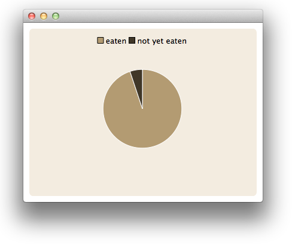
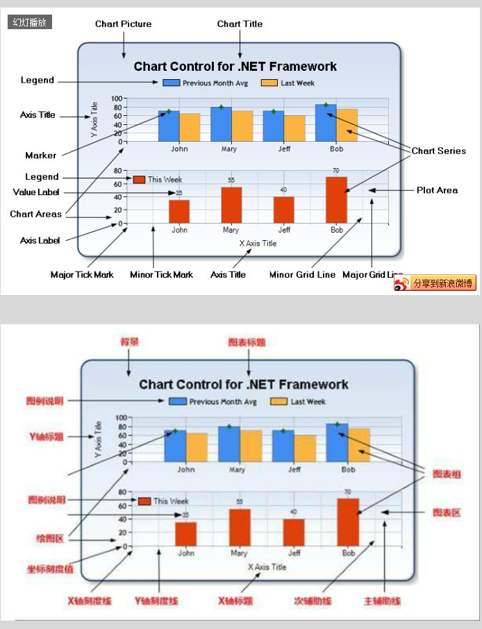

# ChartView QML 类型翻译 

> PS 貌似 Qt 的图表接口参照 c# 的~

> 翻译: qyvlik

## 属性

+ `animationDuration` : `int`

+ `animationEasingCurve` : `easing`

+ `animationOptions` : `Animation`

+ `axes` : list<`AbstractAxis`>

+ `backgroundColor` : `color`

+ `backgroundRoundness` : `real`

+ `count` : `int`

+ `dropShadowEnabled` : `bool`

+ `legend` : `Legend`

+ `locale` : `locale`

+ `localizeNumbers` : `bool`

+ `margins` : `Margins`

+ `plotArea` : `rect`

+ `plotAreaColor` : `color`

+ `theme` : `Theme`

+ `title` : `string`

+ `titleColor` : `color`

+ `titleFont` : `Font` 

## 信号

+ `seriesAdded(AbstractSeries series)`

+ `seriesRemoved(AbstractSeries series)`

## 方法

+ `Axis axisX(AbstractSeries series)`

+ `Axis axisY(AbstractSeries series)`

+ `AbstractSeries createSeries(SeriesType type, string name, AbstractAxis axisX, AbstractAxis axisY)`

+ `isZoomed()`

+ `point mapToPosition(point value, AbstractSeries series)`

+ `point mapToValue(point position, AbstractSeries series)`

+ `removeAllSeries()`

+ `removeSeries(AbstractSeries series)`

+ `scrollDown(real pixels)`

+ `scrollLeft(real pixels)`

+ `scrollRight(real pixels)`

+ `scrollUp(real pixels)`

+ `AbstractSeries series(string name)`

+ `AbstractSeries series(int index)`

+ `setAxisX(AbstractAxis axis, AbstractSeries series)`

+ `setAxisY(AbstractAxis axis, AbstractSeries series)`

+ `zoom(real factor)`

+ `zoomIn(rect rectangle)`

+ `zoomIn()`

+ `zoomOut()`

+ `zoomReset()`

## 详细描述

`ChartView` 是多个不同类型图表实体的父级展示空间。

如下代码展示了一个饼图：

```
import QtQuick 2.0
import QtCharts 2.0

ChartView {
    width: 400
    height: 300
    theme: ChartView.ChartThemeBrownSand
    antialiasing: true

    PieSeries {
        id: pieSeries
        PieSlice { label: "eaten"; value: 94.9 }
        PieSlice { label: "not yet eaten"; value: 5.1 }
    }
}
```



可以先参照如下的图：

> [微软Chart属性学习 ](http://blog.sina.com.cn/s/blog_68cae6d301016iqo.html)



## 属性文档

+ `animationDuration` : `int`

    图表视图的动画时长。

+ `animationEasingCurve` : `easing`

    动画的类型，动画时间与输出数值的函数类型，例如二次贝塞尔。参照 `Animation.easing` 的属性组进行设置。

+ `animationOptions` : `Animation`

    图表视图的动画类选项。取值可能如下：

    + `ChartView.NoAnimation`

    + `ChartView.GridAxisAnimations`

    + `ChartView.SeriesAnimations`

    + `ChartView.AllAnimations`

+ `axes` : list<`AbstractAxis`>

    图表视图的多个轴。

+ `backgroundColor` : `color`

    图表视图的背景颜色，默认背景颜色和 `ChartView.theme` 所设置的一样。

+ `backgroundRoundness` : `real`

    背景圆角。

+ `count` : `int`

    图表视图中有几个图表。

+ `dropShadowEnabled` : `bool`

    图表视图的阴影。

+ `legend` : `Legend`

    图表视图的图例说明。可以通过 `legend.visible` 设置图例说明是否可见。`legend.font` 设置字体。详情请看 `Legend`。

+ `locale` : `locale`

    本地化文本选项，例如数字之间是否要使用逗号隔开。

+ `localizeNumbers` : `bool`

    是否设置本地化文本。

+ `margins` : `Margins`

    定义内边距。边距内部是图表视图用来绘制标题，轴（坐标）和图例说明的。

+ `plotArea` : `rect`

    图表区大小。

+ `plotAreaColor` : `color`

    图表区颜色。

+ `theme` : `Theme`

    图表视图的主题设定。

    有如下值：
    
    + `ChartView.ChartThemeBlueCerulean`
    
    + `ChartView.ChartThemeBlueIcy`
    
    + `ChartView.ChartThemeBlueNcs`
    
    + `ChartView.ChartThemeBrownSand`
    
    + `ChartView.ChartThemeDark`
    
    + `ChartView.ChartThemeHighContrast`
    
    + `ChartView.ChartThemeLight`
    
    + `ChartView.ChartThemeQt`

+ `title` : `string`

    图表视图标题。

+ `titleColor` : `color`

    图表视图标题颜色。

+ `titleFont` : `Font` 

    图表视图标题字体。
    
## 信号文档

+ `seriesAdded(AbstractSeries series)`

    当有新的 `series` 添加到图表视图中时触发。

+ `seriesRemoved(AbstractSeries series)`

     当从图表视图中移除 `series` 时触发。

## 方法文档

+ `Axis axisX(AbstractSeries series)`

    某个图表的 x 轴。

+ `Axis axisY(AbstractSeries series)`

    某个图表的 y 轴。

+ `AbstractSeries createSeries(SeriesType type, string name, AbstractAxis axisX, AbstractAxis axisY)`

    用来创建对应类型的图表。用法如下：
    
    ```
    // lineSeries is a LineSeries object that has already been added to the ChartView; re-use it's axes
    var myAxisX = chartView.axisX(lineSeries);
    var myAxisY = chartView.axisY(lineSeries);
    var scatter = chartView.createSeries(ChartView.SeriesTypeScatter, "scatter series", myAxisX, myAxisY);
    ```
    
    其中 `SeriesType` 有如下值：

    + `ChartView.SeriesTypeArea`
    
    + `ChartView.SeriesTypeBar`
    
    + `ChartView.SeriesTypeBoxPlot`
    
    + `ChartView.SeriesTypeHorizontalBar`
    
    + `ChartView.SeriesTypeHorizontalPercentBar`
   
    + `ChartView.SeriesTypeHorizontalStackedBar`
    
    + `ChartView.SeriesTypeLine`
    
    + `ChartView.SeriesTypePercentBar`
    
    + `ChartView.SeriesTypePie`
    
    + `ChartView.SeriesTypeScatter`
    
    + `ChartView.SeriesTypeSpline`
    
    + `ChartView.SeriesTypeStackedBar`
    
+ `isZoomed()`

    如果图表视图中任意一个图表实体被缩放或者放大，返回 `true`。

+ `point mapToPosition(point value, AbstractSeries series)`

    将在图表视图上的点映射为图表实体上的点。

+ `point mapToValue(point position, AbstractSeries series)`

    将在图表实体上的点映射为图表视图上的点。

+ `removeAllSeries()`

    移除所有的图表实体。

+ `removeSeries(AbstractSeries series)`

    移除指定的图表实体。

+ `scrollDown(real pixels)`

    将图表视图内容向下滚动指定像素。

+ `scrollLeft(real pixels)`

    将图表视图内容向左滚动指定像素。
    
+ `scrollRight(real pixels)`

    将图表视图内容向右滚动指定像素。

+ `scrollUp(real pixels)`

    将图表视图内容向上滚动指定像素。

+ `AbstractSeries series(string name)`

    通过名字来获取图表实体。如果有同名，只返回第一个匹配的图表实体。

+ `AbstractSeries series(int index)`

    通过下标来获取图标实体。

+ `setAxisX(AbstractAxis axis, AbstractSeries series)`

    为图标实体设置 x 轴。

+ `setAxisY(AbstractAxis axis, AbstractSeries series)`

    为图标实体设置 y 轴。

+ `zoom(real factor)`

    设置缩放因子。默认为 1。有效值为 0.0 到 1.0。

+ `zoomIn(rect rectangle)`

    将视图放大到指定的 `rect` 范围。

+ `zoomIn()`

    放大视图。

+ `zoomOut()`

    缩小视图。

+ `zoomReset()`

    重置视图大小。
