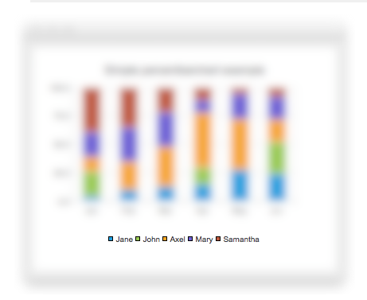

# Legend QML 类型翻译

> 翻译：qyvlik

`Legend` 在图表视图中是图例说明的意思。

## 属性

+ `alignment` : `Qt.Alignment`

+ `backgroundVisible` : `bool`

+ `borderColor` : `color`

+ `color` : `color`

+ `font` : `Font`

+ `labelColor` : `color`

+ `reverseMarkers` : `bool`

+ `showToolTips` : `bool`

+ `visible` : `bool` 

## 详细描述

`Legend` 是一个图元对象，用来展示图例说明的。当图表视图中的图表实体更新时，`ChartView` 就会对 `Legend` 的状态进行更新。

```
ChartView {
  legend.visible: true
  legend.alignment: Qt.AlignBottom
  // Add a few series...
}
```

> PS：`Legend` 不可实例化，只能通过图表视图的 `ChartView::legend` 属性进行更新。



请注意，不同于 Qt 的图标接口，QML 接口可以修改图例说明的 markets。可以查看 [Qml Custom Example](http://doc.qt.io/qt-5/qtcharts-qmlcustomlegend-example.html)，如何自定义图例说明。

## 属性文档

+ `alignment` : `Qt.Alignment`

    文本对齐方式。有如下取值：

    + `Qt.AlignTop`

    + `Qt.AlignBottom`

    + `Qt.AlignLeft`

    + `Qt.AlignRight`

+ `backgroundVisible` : `bool`

    是否允许显示背景。

+ `borderColor` : `color`

    图例说明边框颜色

+ `color` : `color`

    图例说明的颜色

+ `font` : `Font`

    图例说明的字体

+ `labelColor` : `color`

    图例说明的字体颜色

+ `reverseMarkers` : `bool`

    Whether reverse order is used for the markers in legend or not. 默认为 `false`。

+ `showToolTips` : `bool`

    显示提示，此版本的 QML 不支持此特性。

+ `visible` : `bool` 

    是否显示图例说明。

