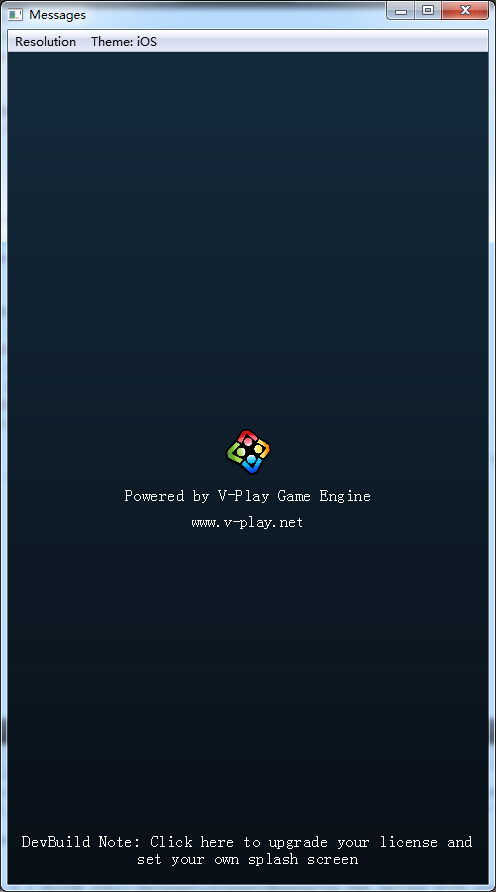
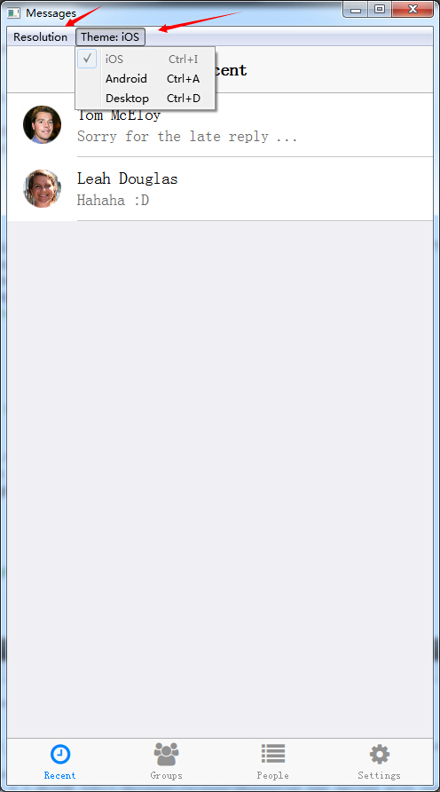

# V-Play 使用粗体验

> 作者 [qyvlik](http://blog.qyvlik.space)

## 在 window 7 上

其实 Window 7 是作为生产和开发的环境。

所以一般可以用来调试其他手机的界面适配的问题。

如果没有申请 `liencen key`，启动后会显示如下的 `SplashScreen`

 启动后如下：

可以更换主题和尺寸。 

## 安卓

在安卓上，使用页面导航 + 页面栈的方法管理页面。

非常好的处理了回退按钮与页面导航。

但是在处理类似聊天界面时，仍然有些许问题。

详细 bug 描述参见 [Android device can't friendly fix the application scene when virtual keyboard was display.](https://bugreports.qt.io/browse/QTBUG-49656) 以及 [[Android]: When the window resizes then there it will cause flicker](https://bugreports.qt.io/browse/QTBUG-41170)。

## 手机风格主题切换

不是安卓手机只能使用安卓的风格主题，是可以切换到 ios 的主题的。各个系统的主题风格各有差异，可以自行进行配置。
