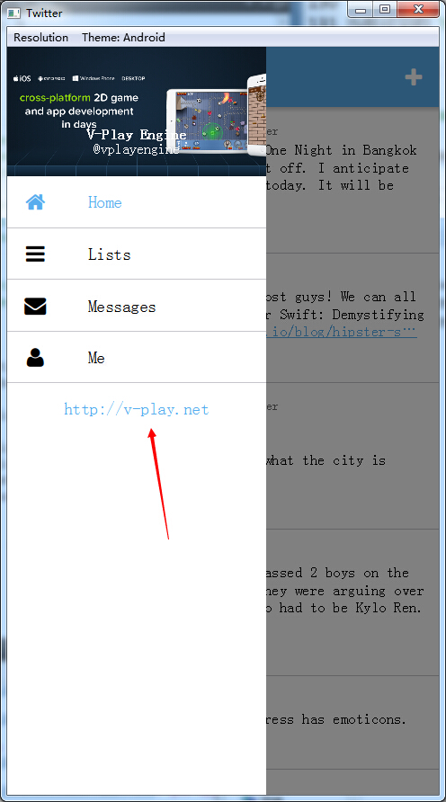

# V-Play 文档翻译 Navigation

> 翻译：qyvlik

平台对应的导航控制器。

>VPlayApps 1.0

>Inherits: Item

## 属性

+ `count` : `int`

+ `currentIndex` : `int`

+ `currentNavigationItem` : `NavigationItem`

+ `drawer` : `AppDrawer`

+ `drawerVisible` : `bool`

+ `footerView` : `Component`

+ `headerView` : `Component`

+ `navigationDrawerItem` : `Component`

+ `navigationDrawerItemPressed` : `bool`

+ `navigationMode` : `int`

+ `tabPosition` : `alias`

+ `tabsVisible` : `bool`

## 方法

+ `addNavigationItem(component)`

+ `getNavigationItem(index)`

+ `insertNavigationItem(index, component)`

+ `moveNavigationItem(from, to)`

+ `removeNavigationItem(index)`

## 详细描述

The Navigation can be used to automatically use different navigation modes depending on the used platform. It supports navigation by `TabControl` on top or on bottom of the screen, by `AppDrawer`, or both.

根据运行的平台使用不同的导航方案（其实你修改 `Theme.platform` 可以直接使用不同平台的导航方案）。可以支持在顶边或者底边标签页导航 `TabControl`，也可以支持抽屉式导航（侧边栏） `AppDrawer`。

By default `TabControl` is used on iOS and `AppDrawer` with an `AppListView` as content item on Android. You can change the styling of the `AppDrawer`'s `AppListView` by overriding values from `Theme::navigationAppDrawer`.

一般，在 iOS 上使用标签页导航，在安卓上使用抽屉式导航，这个抽屉式导航以`AppDrawer` 为主题 `AppListView` 作为内容。你可以通过修改 `Theme::navigationAppDrawer` 来使用不同的风格样式的 `AppListView`。

**Note**: `Navigation` uses a lazy-loading mechanism for the contents of each `NavigationItem` element. This means, that the items within a `NavigationItem` are created when it is selected for the first time.

**注意**：`Navigation` 使用惰性加载的机制，来加载每一个 `NavigationItem`。直到第一次使用 `NavigationItem` 才会加载它。

### 用法

The following code from the widget showcase app demonstrates how easy it is to add platform-specific navigation to your app:

如下代码演示了在应用上使用平台特定的导航方案是如此的简单：

```
App {
  Navigation {
    NavigationItem {
      id: widgetsItem
      title: "Widgets"
      icon: IconType.calculator

      WidgetsPage { title: widgetsItem.title }
    }

    NavigationItem {
      title: "Simple List"
      icon: IconType.list

      NavigationStack { //this tab/navigation item uses stack-based sub-navigation
        SimpleListPage { }
      }
    }

    NavigationItem {
      title: "Sub-Tabs"
      icon: IconType.tablet

      SubTabsPage { }
    }

    NavigationItem {
      title: "Sub-Drawer"
      icon: IconType.chevroncircleright

      SubDrawerPage { }
    }

    NavigationItem {
      title: "Dialogs"
      icon: IconType.square

      DialogsPage { }
    }
  }
}
```

## 属性文档

> `count` : `int` read-only

Holds the number of NavigationItems.

`NavigationItem` 的个数。

> `currentIndex` : `int`

Gets or sets the index of the currently visible `NavigationItem`.

当前可见的 `NavigationItem` 的下标，可修改。

> `currentNavigationItem` : `NavigationItem` read-only

Holds the currently visible `NavigationItem`. To change it, `currentIndex` property can be changed.

当前可见的 `NavigationItem` 的只读引用，通过修改 `currentIndex` 来改变这个引用。

> `drawer` : `AppDrawer`

The `AppDrawer` object, which is used if drawer navigation is enabled.

如果允许使用抽屉式导航方案，设置导航对象的 `AppDrawer`。

> `drawerVisible` : `bool` read-only

Holds true, if `AppDrawer` is used for navigation. Change by changing the `navigationMode` property.

是否可以使用抽屉式的导航方案，可以修改 `navigationMode` 来改变这个属性。

> `footerView` : `Component`

Component for an Item to appear in the `AppDrawer`, below the `NavigationItem` entries.

在 `AppDrawer` 中显示，位于 `NavigationItem` 下方。

 

> `headerView` : `Component`

Component for an Item to appear in the `AppDrawer`, above the `NavigationItem` entries. Per default, this is an invisible item that adds as a padding for the device status bar.

在 `AppDrawer` 中显示，位于 `NavigationItem` 上方。一般是一个不可见的项，填充在设备的状态栏（或许是在系统的状态栏吧）。

> `navigationDrawerItem` : `Component`

This property defines an item that is shown to toggle the navigation drawer state of the `Navigation`'s `AppDrawer` item.

用于定义一个控件，用以切换 `Navigation` 的 `AppDrawer` 的状态。

By default a toggle `Icon` is provided, which is sufficient in most cases. If you want to customize that icon you can make use of `navigationDrawerItemPressed` property to define a custom style for the pressed state.

一般会提供一个 `Icon` 进行切换，多数情况下是够用的。如果你想定制自己的 `Icon` 来今晚状态切换， `navigationDrawerItemPressed` 是你需要的一个属性。

Here is an example of providing your custom item:

如下：

```
Navigation {
 id: navigation

  navigationDrawerItem: Text {
    text: "Open"
    anchors.centerIn: parent
    color: navigation.navigationDrawerItemPressed ? "red" : "green"
  }
}
```

> `navigationDrawerItemPressed` : `bool` read-only

Use this readonly property to customize the pressed state of a custom provided `navigationDrawerItem`.

导航切换按钮是否被按下，用以定制 `navigationDrawerItem`。

> `navigationMode` : `int`

Possible values are:

可能只如下：

- `navigationModeDefault`: Platform-specific default value (drawer for Android, tabs everywhere else)

- `navigationModeTabs`: Use only `TabControl`

- `navigationModeDrawer`: Use only `AppDrawer`

- `navigationModeTabsAndDrawer`: Use `TabControl` and `AppDrawer` at the same time

> `tabPosition` : `alias`

Alias for TabView::tabPosition.

`TabView::tabPosition` 的引用。

> `tabsVisible` : `bool` read-only

Holds true, if `TabControl` is used for navigation. Change by changing the `navigationMode` property.

是否可以使用标签页的导航方案，可以修改 `navigationMode` 来改变这个属性。


## 方法文档

> `addNavigationItem(component)`

Add a new `NavigationItem` at the end. The component should be a `Component` instantiating a `NavigationItem`.

添加一个新的 `NavigationItem`。参数 `component` 应该是一个包含 `NavigationItem` 的 `Component`。

Returns the created `NavigationItem` object.

返回创建的 `NavigationItem`。

> `getNavigationItem(index)`

Returns the `NavigationItem` at the specified index.

返回指定下标的 `NavigationItem`。

> `insertNavigationItem(index, component)`

Add a new `NavigationItem` at the specified index. The component should be a `Component` instantiating a `NavigationItem`.

插入一个新的 `NavigationItem` 到指定下标，参数 `component` 应该是一个包含 `NavigationItem` 的 `Component`。

Returns the created NavigationItem object.

返回创建的 `NavigationItem`。

> `moveNavigationItem(from, to)`

Move the `NavigationItem` at the specified index from to the index to.

将指定下标的 `NavigationItem` 移动到指定的位置。

> `removeNavigationItem(index)`

Remove the `NavigationItem` at the specified index.

移除对应下标的 `NavigationItem`。
