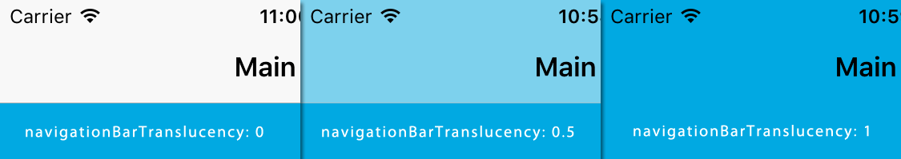

# V-Play 文档翻译 Page

> 翻译：qyvlik

应用的一个页面。

> VPlayApps 1.0

> Inherits: MouseArea

> Inherited By: ListPage

## 属性

+ `Item` : `NavigationStack`

+ `backNavigationEnabled` : `bool`

+ `backgroundColor` : `color`

+ `canNavigateBack` : `bool`

+ `leftBarItem` : `Item`

+ `navigationBarHidden` : `bool`

+ `navigationBarTranslucency` : `real`

+ `navigationStack` : `NavigationStack`

+ `rightBarItem` : `Item`

+ `tabBarHidden` : `bool`

+ `title` : `string`

+ `titleItem` : `Item`

## 详细描述

The Page type provides a container for the contents of a single page within an application.

应用的一个页面提供一个内容。

## 属性文档

> `Item` : `NavigationStack` read-only

The nearest parent item in the QML hierarchy that is a `NavigationStack` item. (read-only)

在 QML 层次中最亲近的父级项 `NavigationStack`。

If the current item or one of its parent items is a child of a `NavigationStack` item, this property contains the owning `NavigationStack` item. This property is `null` if the `Page` is not embedded inside a `NavigationStack` item.

如果当前项的直接父级项是 `NavigationStack` 的孩子，则这个属性会自动包含 `NavigationStack`。如果这个属性为 `null`，则 `Page` 不在 `NavigationStack` 中。

> `backNavigationEnabled` : `bool`

Set this property to `false` to disable the back navigation within a page in a `NavigationStack` if previous pages exist on the stack.

设置为 `false`，则不予显示回退按钮。

Disabling the back navigation hides the "back" button within a `NavigationBar`, deactivates the iOS back swipe gesture and also disables the hardware back button on Android and Windows Phone.

隐藏位于 `NavigationBar` 上的回退按钮，意味着 iOS 上滑动回退以及安卓和 WP 上硬件返回键无效。

The default value is `false`, if the current page is the first one inside a `NavigationStack`, `true` otherwise.

如果当前页面为 `NavigationStack` 的第一个页面，默认值为 `false`。

> `backgroundColor` : `color`

The background color of the `Page` which is displayed if no other items are placed within the page.

`Page` 的背景色，如果没有被其他项所替代，就会显示此颜色。

The default value is defined in the `Theme::backgroundColor` property and can be overridden.

默认值是 `Theme::backgroundColor`，可重新定义。

> `canNavigateBack` : `bool` read-only

Readonly property holds whether it is possible to actually navigate back within the current stack. The property is `true` if a previous page exists on the stack, otherwise `false`.

当前页面是否可以回退到上一级，只读。

This QML property was introduced in V-Play 2.7.0.

> `leftBarItem` : `Item`

A custom navigation bar item displayed on the left of the navigation bar if the item is on top of a `NavigationStack` as a direct child of it.

如果 `Page` 是 `NavigationStack` 的直接孩子，则显示自定义导航栏左边控件。

By default this item displays a back navigation item if the current `NavigationStack` can navigate back. If setting the item to an explicit `NavigationBarItem` it replaces the back button with the custom item.

如果当前 `NavigationStack` 可以回退至上一页，则默认显示一个回退按钮。如果直接使用 `NavigationBarItem` 来替代的话，会显示定制的控件。

> `navigationBarHidden` : `bool`

A boolean value indicating whether the navigation bar should be hidden for that specific Page if the item is presented within a `NavigationStack` item.

You can set this property to false to implement a custom styled full-screen page within a `NavigationStack` without the default navigation bar behavior (make sure to implement a custom back navigation action in that case).

By default this property is `false`, meaning that the navigation bar is visible for that Page.

大体意思就是是否隐藏导航栏。

> `navigationBarTranslucency` : `real`

Set this value to make the navigation bar translucent for that specific Page within a `NavigationStack`.

The allowed value range is 0.0 to 1.0. The default value is 0.0, meaning that the navigation bar is not translucent (fully opaque).

注意这里的是系统的状态栏做文章，具体就是一个应用以全屏方式显示，但是状态栏没有被应用覆盖，并且自身保持一定的透明度，以显示下层的应用画面。这里是调整系统状态栏的透明度的。默认值为 0.0，不透明。

大体就是沉浸式了。

If using a translucent navigation bar, the page content will move beneath the navigation bar and you should add that extra spacing for your pages on your own (you can get the current height from `ThemeNavigationBar::height`).

如果使用了沉浸式导航栏（系统状态栏沉浸，与应用融为一体），需要使用  `ThemeNavigationBar::height` 修复 `Page` 的高度。

> `navigationStack` : `NavigationStack` read-only

The nearest parent item in the QML hierarchy that is a `NavigationStack` item. (read-only)

在 QML 层次中最亲近的父级项 `NavigationStack`。

If the current item or one of its parent items is a child of a `NavigationStack` item, this property contains the owning `NavigationStack` item. This property is `null` if the `Page` is not embedded inside a `NavigationStack` item.

如果当前项的直接父级项是 `NavigationStack` 的孩子，则这个属性会自动包含 `NavigationStack`。如果这个属性为 `null`，则 `Page` 不在 `NavigationStack` 中。

> `rightBarItem` : `Item`

A custom navigation bar item displayed on the right of the navigation bar if the item is on top of a `NavigationStack` as a direct child of it.

如果 `Page` 是 `NavigationStack` 的直接孩子，则显示自定义导航栏右边控件。

By default this item is empty.

默认为空。

> `tabBarHidden` : `bool`

A boolean value indicating whether a tab bar should be hidden for that specific Page if the item is presented within a `Navigation` item showing tabs.

By default this property is `false`, meaning that the tab bar is visible for that Page.

是否显示选项板控制控件。默认不显示。

> `title` : `string`

A localized, human-readable string that represents the the content of this page.

The title is used as string in a navigation bar if the Page item is a child of a `NavigationStack`.

显示本页面的标题，如果当前 `Page` 是 `NavigationStack` 的直接孩子，就显示在导航栏上。

> `titleItem` : `Item`

A custom navigation bar item displayed at the title slot of the navigation bar if the item is on top of a NavigationStack as a direct child of it.

By default, the title of the page is displayed.

This QML property was introduced in V-Play 2.6.2.

用以显示自定义标题，例如带有图片的标题等。
