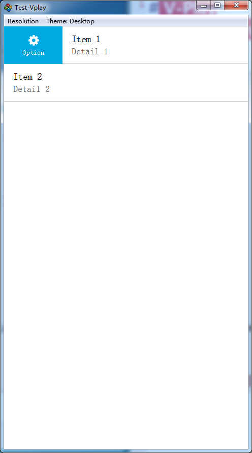
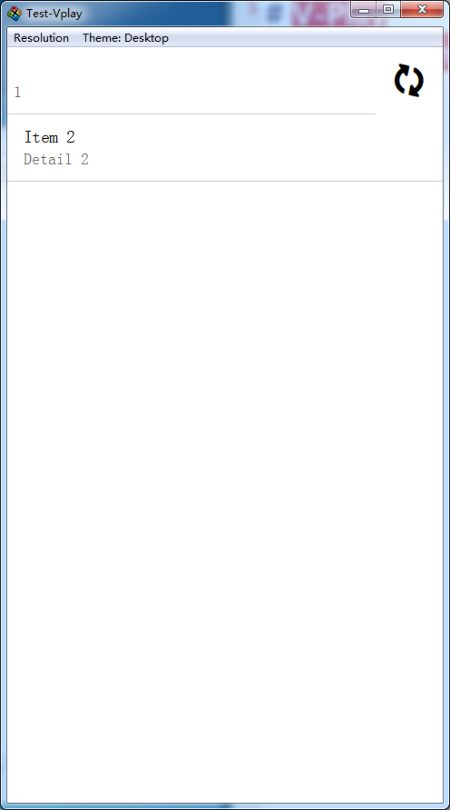

# V-Play SwipeOptionsContainer

效果就是类似 QQ 那个，某个列表项目的侧滑效果。

```
App {

  ListPage {
    //some JS array as list model
    model: [{text: "Item 1", detailText: "Detail 1"}, {text: "Item 2", detailText: "Detail 2"}]

    // define the SwipeOptionsContainer as delegate
    delegate: SwipeOptionsContainer {
      id: container

      SimpleRow {                         //actual content to be displayed in the list rows
        id: row
      }

      leftOption: SwipeButton {           //left options, displayed when swiped list row to the right
        text: "Option"
        icon: IconType.gear
        height: row.height
        onClicked: {
          row.item.text = "Option clicked"
          row.itemChanged()
          container.hideOptions()         //hide automatically when button clicked
        }
      }

      rightOption: AppActivityIndicator { //right options, displayed when swiped list row to the left
        height: row.height
        width: height
      }
      onRightOptionShown: {
          console.log("now refresh")
      }
    } // SwipeOptionsContainer
  } // ListPage

}
```



