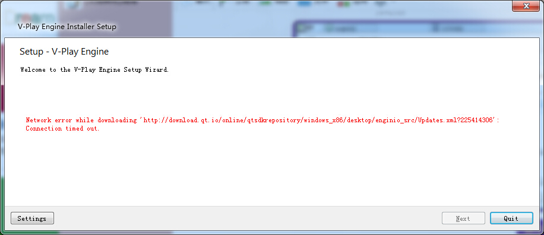
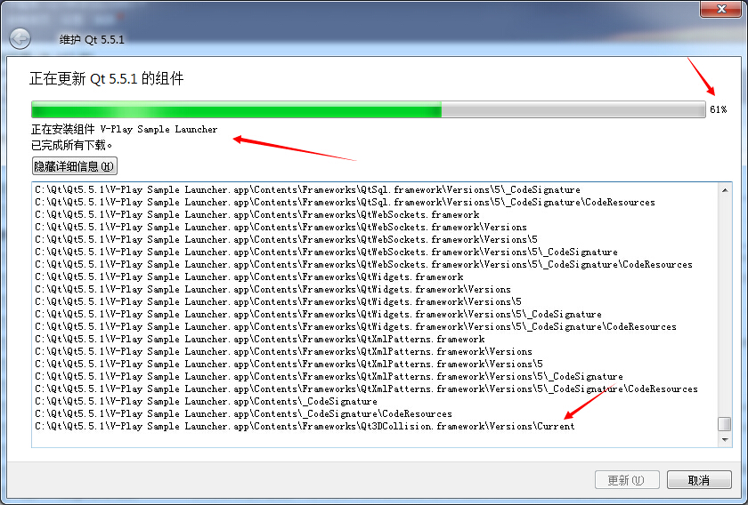
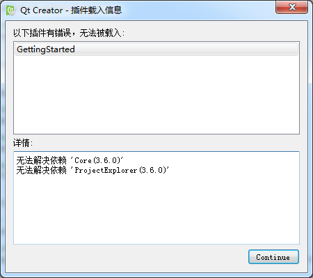

# 安装 V-Play 笔记

> 作者 [qyvlik](http://blog.qyvlik.space)

> V-Play 2.7.1, Qt 5.5.1, QtCreator 3.5.1

V-Play 是三年前开始开发的一个商业用 2D 游戏引擎。发展到现在，在游戏开发和应用开发有所建树，尤其是应用开发中，是现阶段 QML 开发应用一个较好的方案，当然反驳的人是拿不出第二款如此成熟的 QML 应用开发框架。（如果有的话，请务必安利给我。）

## 遇到问题

直接使用安装包安装可能会出现如下问题：

放弃这种安装方式。

另一方面，v-play 的官方客服立刻在邮件上问我，是否在安装过程遇到了问题。安装后会定时发送一些 V-Play 的精品教材，虽然是英语的，但是没有使用过多高深的词汇。

---

如果以及安装了 Qt (Qt 5)，可以直接使用 `MaintenanceTool` 进行组件更新。

[add-v-play-to-existing-qt-installation](http://v-play.net/doc/vplay-installation/#add-v-play-to-existing-qt-installation)

Click the Settings button and in the Settings window, click on the Repositories tab. Click on the bottom section User defined repositories and then click the  Add Repository button.

Now enter the URL for your development platform in the text box. It is either:

- https://sdk.v-play.net/2/windows

- https://sdk.v-play.net/2/macx

- https://sdk.v-play.net/2/linux

Next, confirm the V-Play installation repository with OK and proceed with the Package Manager option by pressing the Next button.

You can then proceed with the steps of Download & Install V-Play like described above.

现在卡在 61 %:

---

重新安装 Qt 5.5.1，然后在使用 `MaintenanceTool` 安装 V-Play 成功。

每次启动时，都会提示如下图：

一般直接升级 `QtCreator` 为 3.6。覆盖安装。

[V-Play 官网](http://v-play.net/)，下载前记得注册账号哦。
