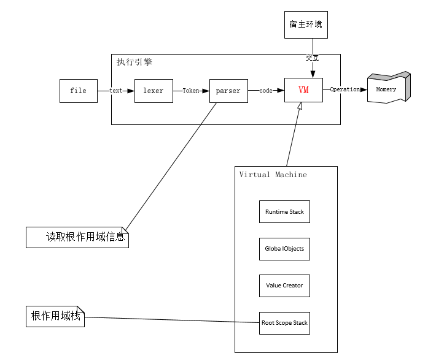
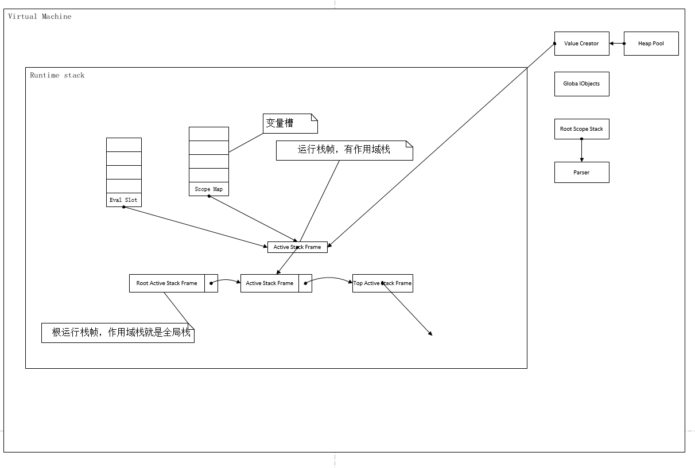
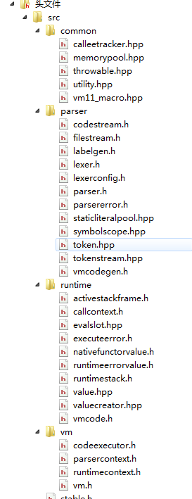
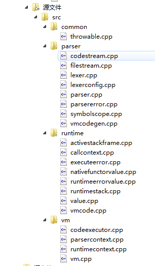
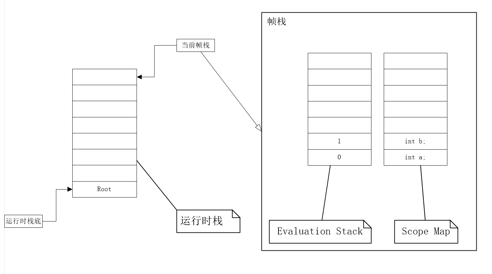
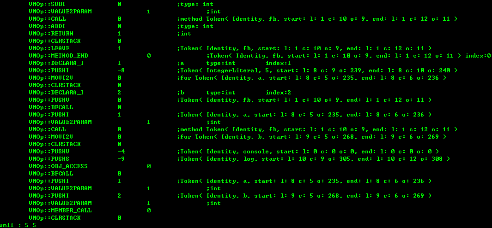
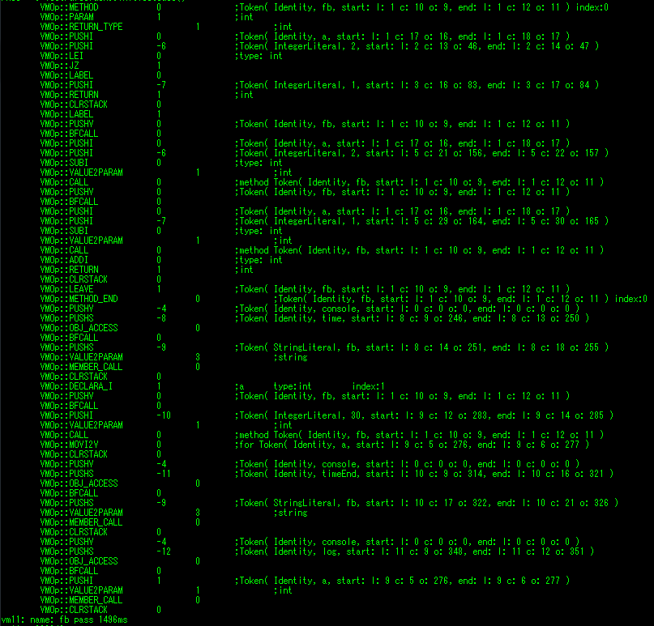

# 脚本语言的栈式虚拟机的实现

# 摘要

如今脚本语言与编译型语言在编程领域平风秋色，出名的脚本语言有 python, lua, JavaScript，在不同的领域发挥着不同的作用。随着脚本技术的快速发展，python，lua，以及 JavaScript 发展势头十分强劲，应用程序通过脚本支持已成为实现软件可定制和可拓展的有效方案，而这背后的动力，都是需要一个强大的虚拟机来进行支持。

虚拟机在任何平台上都是提供给编译程序一个共同的接口，编译程序是要面向虚拟机，生成虚拟机能够识别的代码，然后就可以由虚拟机解释执行。虚拟机实现了程序与操作系统和硬件的分离，从而实现了应用程序与平台的无关性。

而虚拟机改如何设计，该采取何种数据结构，改通过何种方式和宿主环境交互，如何提高虚拟机的灵活性，通过本文对虚拟机特性的描述和实际测试，获取足够测试数据，配以科学理论，进行虚拟机的设计探讨。

关键词：虚拟机，栈式虚拟机，虚拟机实现

## 研究背景及意义

### 研究背景

如今脚本语言与编译型语言在编程领域平风秋色。出名的脚本语言有 python, lua, JavaScript，在不同的领域发挥着不同的作用。

例如在游戏领域，《大话西游II》便是采用 lua 进行开发的[2]；浏览器上运行的 JavaScript；Python 在机器学习和人工智能的发展。

基本所有领域都有脚本语言的影子，脚本语言相对编译型语言，在运行效率上可能稍微逊色，但是可以通过对脚本语言进行特行裁剪和拓展，使其开发效率高于传统的编译型语言。

除了对脚本语言的特性进行裁剪以提升开发效率外，通过优化执行脚本语言的虚拟机，使其运行效率逼近编译型语言。

运行脚本语言的方式多种多样，如遍历语法树的解释执行，也有基于指令集的线性解释执行，也有使用及时编译（JIT）翻译为本地机器码然后执行。

本文将对虚拟机的运行时设计进行探讨和实现。

### 课题意义

近年来，随着脚本技术的快速发展，python，lua，以及 JavaScript 发展势头十分强劲，应用程序通过脚本支持已成为实现软件可定制和可拓展的有效方案，而这背后的动力，都是需要一个强大的虚拟机来进行支持。

例如许多浏览器的内核是使用到谷歌浏览器内核 Chromium 的，而 Chromium 的 JavaScript 引擎便是 V8 引擎。 在 2015 年，谷歌浏览器占据市场份额的 56.51% [11]，这里还不包括以 Chromium 和 IE 作为双内核的浏览器。JavaScript 原本是由 Netscape 公司设计，用于运行在客户端上的语言，得益于 V8 引擎的优异性能和高可拓展性[12]，使得 JavaScript 变成全栈技术的热门语言。

脚本语言在国内游戏，服务器，通信，嵌入式，云服务等领域中使用颇多，就需要支撑脚本稳定运行的虚拟机。例如网易的《大话西游II》，便是使用 lua 4.0 进行开发的。相对于 c/c++，脚本语言对于实现简单又繁琐的游戏逻辑较为方便。得益于 lua 语言规范的精简，虚拟机的优良设计，其创始人称Lua是穿过针孔的语言[13]，加入的任何语言特性都能用C API简单的调用。

脚本引擎一般是由一个执行指令的虚拟机和生成指令的解析器组成，虚拟机模拟真实机器的硬件和机制，并维护一套上下文，而引擎更多是对虚拟机提供的上下文操作的封装，供与宿主交互使用。

## 本文的研究工作及论文结构

本文虚拟机解析的脚本语言是一种类 JavaScript 的语言，其变量的作用域是基于块作用域，并且带有内建函数 `print`。

JavaScript 语言是一种十分流行的语言，最初只是在浏览器上运行的脚本，直到谷歌推出 V8 引擎，以及基于 V8 引擎的 nodejs 的面世，使得 JavaScript 变成一种全栈开发的语言。使用类 JavaScript 语法作为虚拟机的脚本语言，主要考虑到的是 JavaScript 语法贴合 c语言，在编写脚本测试用例时，较为方便，另外，类 JavaScript 语法比较适合编写出基于递归下降的语法解析程序。

具体的脚本语法参考虚拟机设计与实现章节之前端编译器的语法解析部分。

本文由如下章节组成：

1. 虚拟机的基本特性

2. 虚拟机设计与实现

3. 测试

其中 **虚拟机的基本特性** 的主要章节有 **解释器和虚拟机的区别**，**指令**，**内存池**，**栈结构**，等章节。讲诉了虚拟机架构的必要特性与实现虚拟机的必要数据结构。

**虚拟机设计与实现** 主要讲解了虚拟机的运行时与上下文，从代码层面和框架设计上讲解虚拟机的实现。

**测试**则是对虚拟机的实现进行特性测试，通过对虚拟机的关键数据结构的测试，给虚拟机的实现细节做出参考，例如栈有三种不同实现，虚拟机内部的运行栈，计算栈该使用何种实现方式，这些都是需要通过测试，分析才能得出结论。

# 虚拟机基本特性

## 解释器和虚拟机的区别

解释器直接在语法树上遍历执行[3]，并没有实现对真实计算机的模拟。

而虚拟机是一个抽象意义的计算机，他和实际的计算机一样，具有一个指令集合并使用不同的存储区域，他负责执行指令，还对数据，内存和寄存器（运算栈）进行操作[14]。虚拟机在任何平台上都是提供给编译程序一个共同的接口，编译程序是要面向虚拟机，生成虚拟机能够识别的代码，然后就可以由虚拟机解释执行。虚拟机实现了程序与操作系统和硬件的分离，从而实现了应用程序与平台的无关性。

实际上，一台虚拟机与一台真实的计算机的不同之处在于，前者只是一个技术规范，这类技术规范有一系列规则构成，而开发者可以采用任何自己认为适合的手段来实现这些规则[15]。对于一台虚拟机来说，只要它能遵守从其技术规范里的各项规则，就可以做到以具体的计算机平台无关，还可以使用任何一种计算机语言来编写。

## 指令

这里的指令指的是虚拟机执行的指令集，类比真实计算机的汇编指令，既**指令**是由**语法解析器**程序，进行**语法制导**，直接生成或者间接通过抽象语法树生成的线性指令。

线性指令有两大类类型，一类是数据存取，一类是流程跳转，这两类指令，构成了**图灵完备**，这使得虚拟机有通用计算的能力。

指令一般有三地址码，二地址码，一地址码，零地址码等，这几类指令基于两个基本概念：地址和指令。按照面向对象的说法，这两个概念对应于两个类，而各种类型的地址和指令对应于相应的子类。另一种方法是用记录的方式来实现机器码，记录中的字段用来保存地址。[16]

零地址码是一种典型的栈式指令，栈式虚拟机有与之适配的计算栈，隐含了被操作的地址，当零地址码需要显示操作地址时，需要使用更多的指令进行描述，故将零地址进行变换后，即可变为一地址码。

本虚拟机的设计架构为栈式，采用的地址码类型为一地址码，与零地址码类似，一地址码的运算指令是在一个计算栈上完成的。

下面给出几种常见的**一地址指令**形式。

1. 形如 y *op* z 的运算指令，其中 *op* 是一个双目算术符或者逻辑运算符。y,z 是变量，一地址码示例为

    ```
    PUSH y
    PUSH z
    ADD
    ```

2. 形如 x = y *op* z 的赋值指令，其中 *op* 是一个双目算术符或者逻辑运算符。y,z 是变量，一地址码示例为

    ```
    PUSH x
    PUSH z
    ADD
    PUSH x
    MOV
    ```
3. 无条件跳转指令，一地址码示例为

    ```
    JUMP 1
    LABEL 0
    LABEL 1
    ```

4. 条件跳转指令，一地址码示例为

    ```
    PUSH x
    JNZ 1
    LABEL 0
    LABEL 1
    ```

5. 过程定义，调用和返回，一地址码示例为

    ```
    METHOD method                       ; 方法定义
    PUSH 0
    PUSH 0
    ADD
    RET                                 ; 函数返回
    METHOD_END method
    
    BF_CALL                             ; 调用准备，为压栈参数申请空间
    PUSH x1
    PARAM x1                            ; 传递参数
    CALL method                         ; 方法调用
    ```

## 内存池

利用默认的内存管理函数 `new/delete` 或 `malloc/free` 在堆上分配和释放内存会有一些额外的开销。

系统在接收到分配一定大小内存的请求时，首先查找内部维护的内存空闲块表，并且需要根据一定的算法（例如分配最先找到的不小于申请大小的内存块给请求者，或者分配最适于申请大小的内存块，或者分配最大空闲的内存块等）找到合适大小的空闲内存块。如果该空闲内存块过大，还需要切割成已分配的部分和较小的空闲块。然后系统更新内存空闲块表，完成一次内存分配。类似地，在释放内存时，系统把释放的内存块重新加入到空闲内存块表中。如果有可能的话，可以把相邻的空闲块合并成较大的空闲块。

默认的内存管理函数还考虑到多线程的应用，需要在每次分配和释放内存时加锁，同样增加了开销。

可见，如果应用程序频繁地在堆上分配和释放内存，则会导致性能的损失。并且会使系统中出现大量的内存碎片，降低内存的利用率。

默认的分配和释放内存算法自然也考虑了性能，然而这些内存管理算法的通用版本为了应付更复杂、更广泛的情况，需要做更多的额外工作。而对于某一个具体的应用程序来说，适合自身特定的内存分配释放模式的自定义内存池则可以获得更好的性能。

而由于虚拟机在执行计算的过程中，会产生大量的临时小对象，系统的 `new` 与 `delete` 并不适合用来处理此种场景，频繁的使用 `new` 与 `delete`，会造成大量的内存碎片并进而降低性能。此外内存池可以记录到所有被监控的对象，以便更好的分析内存泄露，悬挂指针，性能瓶颈等问题。

## 栈结构

栈是一种经典的数据结构，大体有三种实现方式，静态数组、动态分配的数组、动态分配的链式结构。

使用静态数组实现的栈结构，其优点是压栈，出栈操作都是对其结构内部的下标进行加减，其栈上的元素都是已经预分配好的，但是静态数组实现的栈长度固定，只适合在对栈深度无太大要求，但是需要进行频繁的压栈出栈的操作，例如表达式的计算，可以简单的证明，任何一个复杂的四则运算，在不改变运算结果的情况下，通过变换顺序，即可在一个固定栈深度的计算栈上执行。

动态分配的数组，有静态数组实现的栈的优点，并且解决了静态数组栈深度大小固定的缺点，但是随之而来的问题是，在动态数组每次拓展长度时，都要进行先分配内存空间，然后将旧内存空间上的元素复制到新的内存空间，最后再释放旧内存空间，另外申请大块内存空间时，对系统压力比较大，系统需要为生成的大块内存空间进行内存碎片整理。

使用动态分配的链式结构实现的栈结构的优点是，栈深度的上限就是系统所能分配内存上限，出栈与压栈操作都需要一个内存操作，但是这种结构在进行栈生长时，可以最大限度的利用内存碎片。动态分配的链式结构实现的栈适合用在函数调用上。

在本虚拟机中，使用到栈结构的地方有计算栈与调用栈。可以简单的论证，任意一个表达式的计算，通过不影响结果的乱序后，都可以在限定深度的栈上完成。而调用栈的深度却无直接确定。因此，计算栈的实现以静态数组实现，调用栈的实现以动态分配的链式结构实现。

## 栈地址

虚拟机使用**内存池**充当堆空间，在语法制导过程中，按照变量声明的顺序分配**栈地址**。虚拟机通过**栈地址**存取变量，将**栈地址**保存在**函数调用帧栈**中，通过**栈地址**以及**变量表**与**内存池**中的**对象地址**进行映射。**栈地址**用作指令中的地址操作，用于虚拟机的寻址，有关寻址，请查看下一章节。

对比 JavaScript， JavaScript 本身是没有块级作用域的 [17]，而是采用了函数作用域，这样有个明显的缺点，就是与现在主流编程语言的对作用域的处理不一致，本文虚拟机将采取块级作用域处理变量命名，并给变量生成在栈帧上唯一的地址——栈地址，既**栈地址**的生成是依赖于函数作用域的。

如下代码，分别声明了两个变量，由于两个变量同属于同一个作用域，故安装变量声明的顺序，对每个变量生成唯一的**栈地址**。

```
int a;
int b;
```

在进行语法解析和语法制导后，对标识符 `a` 和 `b` 分别配以 `0` 和 `1` 栈地址。

再看如下代码，声明了两个函数，由于两个函数在被调用时，是拥有不同的栈帧空间，故他们分配的栈地址可能一样，但是实际的内存地址是不一样的，栈地址的寻址依赖于当前栈帧的内存地址。

```
funciton foo() {
	int a = 0;		// stack address : 0
}
funciton foo() {
	int a = 0;		// stack address : 0
}
```

## 寻址方式

在虚拟机中，操作数或指令字写入或读出的方式，有地址指定方式、相联存储方式和堆栈存取方式。采用地址指定方式时，形成操作数或指令地址的方式称为寻址方式。寻址方式分为两类，即指令寻址方式和数据寻址方式，前者比较简单，后者比较复杂。值得注意的是，虚拟机中的**指令的寻址**与**数据的寻址**是交替进行的。

### 指令寻址

指令的寻址方式有以下两种。

#### 顺序寻址方式

由于指令地址在内存中按线性顺序安排，当执行一段程序时，通常是一条指令接一条指令地顺序进行。也就是说，从存储器取出第1条指令，然后执行这条指令；接着从存储器取出第2条指令，再执行第二条指令；接着再取出第3条指令。

这种程序顺序执行的过程，称为指令的顺序寻址方式。为此，必须使用**程序计数器**（又称**指令计数器**）PC来计数指令的顺序号，该顺序号就是指令在内存中的地址。

#### 跳跃寻址方式

当程序转移执行的顺序时，指令的寻址就采取跳跃寻址方式。所谓跳跃，是指下条指令的地址码不是由**程序计数器**给出，而是由本条指令给出。注意，程序跳跃后，按新的指令地址开始顺序执行。因此，程序计数器的内容也必须相应改变，以便及时跟踪新的指令地址。

采用指令跳跃寻址方式，可以实现**程序转移**或构成**循环程序**，从而能缩短程序长度，或将某些程序作为公共程序引用。指令系统中的各种条件转移或无条件转移指令，就是为了实现指令的跳跃寻址而设置的。

### 操作数寻址

形成操作数的有效地址的方法称为操作数的寻址方式。由于大型机、小型机、微型机和单片机结构不同，从而形成了各种不同的操作数寻址方式。例如**隐含寻址**，**立即寻址**，**直接寻址**，**间接寻址**，**寄存器寻址方式和寄存器间接寻址方式**，**相对寻址方式**，**基址寻址方式**，**变址寻址方式**，**块寻址方式**等，各种寻址方式有其优缺点以及适配的虚拟机模型。

本文的虚拟机的指令是一地址指令，地址直接放置参数部分，或者隐含在计算栈之中。地址使用的**栈地址**，在变量声明时分配。

如下的指令，表示的将**栈地址** `0` 和 `1`  上的变量压入计算栈中，然后取出栈顶两元素进行加法运行，然后将结果压入栈顶。

```
PUSH 0
PUSH 1
ADD 
```

## 全局对象

为了简化设计和提高内存利用率，我们将字面量统一写入到全局对象中，全局对象使用一个哈希表，通过将**全局地址**作为索引，对象的**内存地址**作为值，将虚拟机的**全局地址**与**内存地址**进行映射。字面量包括字符串字面量和数字字面量，在写入到全局对象中时，将相同的字面量进行合并，并为之分配一个虚拟机的**全局地址**，与**栈地址**类似，都是作为指令中地址操作数，用于虚拟机寻址。

**全局地址**的分配与 **栈地址**的分配一样，都是顺序分配。

此外全局对象还用于实现虚拟机的上下文，通过一个名称-全局地址的映射表，将名称与虚拟机上下文的**全局地址**进行映射，通过**全局地址**，进一步索引到对象**内存地址**。

## 上下文

虚拟机最重要的一点是，实现了对物理计算机的模拟，运行在其中的脚本程序相当于物理计算机中的进程或者线程，不同进程或者线程进行交互时，需要一个接口，这就要求虚拟机内部有一个可配置，可调控的**上下文**，通过向**上下文**写入全局对象，或者设定虚拟机的栈深度等，使得宿主语言可以方便的与虚拟机进行交互。

例如向虚拟机上下文写入一个函数对象 `print`，作为虚拟机的内建函数使用。

```
// c++
Value* print = new Function();
vm->setContext("print", print);

// script
print(1, 1, 2);    // print 是在c++ 通过虚拟机上下文注册的原生函数。
```

通过向虚拟机的上下文注册原生函数，可以弥补虚拟机执行脚本效率低下的问题，且可以有效的提升虚拟机的灵活性。

# 虚拟机设计与实现

虚拟机和实际的计算机一样，具有一个指令集合并使用不同的存储区域，他负责执行指令，还对数据，内存和寄存器（运算栈）进行操作[14]。

这一章节主从虚拟机的运行时，虚拟机的前端编译器两大部分进行解释。

## 架构图



## 虚拟机组成



一个虚拟机主要组成有**调用栈**，**全局对象池**，**机器码执行器**，**前端编译器**等。

## 运行时

运行时的源码文件有如下：

头文件：



源文件：



项目目录由 `parser`，`runtime`，`vm`，`common` 文件夹组成，其中 `parser` 为前端编译器部分，主要是将文件内容读入，并解析生成指令序列。`runtime` 主要是构建虚拟机的运行时与上下文，`vm` 主要是将前端编译器和运行时合并在一起，并提供注册接口，供宿主语言与之交互。

主要有如下主要的类： `ActiveStackFrame`，`CallContext`，`EvalSlot`，`ExecuteError`，`NativeFunctorValue`，`RuntimeErrorValue`，`RuntimeStack`，`Value`，`ValueCreator`，`VMOp`，`VMCode`，`JumpMap` 等。

### 指令

本文虚拟机指令是**一地址指令**，由**操作指令**和**操作数**组成，**操作数**一般是**栈地址**或者是**全局地址**或者是**标签**，部分**指令**的参数隐含在计算栈中。

其中**标签**又分为**逻辑跳转标签**和**函数定义标签**。

如下为虚拟机的部分重要指令。

| 指令         | 操作符 | 格式                              | 备注                                 |
| ------------ | ------ | --------------------------------- | ------------------------------------ |
| NOTHING      |        |                                   | 占位符，空指令                       |
| AND          | &&     | AND                               | 逻辑与                               |
| OR           |        |                                   | 逻辑或                               |
| ADD_*        | +      | ADD                               | 加法                                 |
| SUB_*        | -      | SUB                               | 减法                                 |
| MUL_*        | *      | MUL                               | 乘法                                 |
| DIV_*        | /      | DIV                               | 除法                                 |
| MOD_*        | %      | MOD                               | 取模                                 |
| LT_*         | <      | LT                                | 小于                                 |
| LE_*         | <=     | LE                                | 小于等于                             |
| GT_*         | >      | GT                                | 大于                                 |
| GE_*         | >=     | GE                                | 大于等于                             |
| ASSIGN_*     | =      | ASSIGN                            | 赋值                                 |
| PUSH_*       |        | PUSH    栈地址或者全局地址        | 将指定地址的变量压入指定的计算栈     |
| MOV_*_2_*    |        | MOV                               | 将指定计算栈栈顶出栈后压入指定计算栈 |
| DECLARA_*    |        | DECLARA    栈地址                 | 声明指定类型变量                     |
| BFCALL       |        | BFCALL                            | 调用前预购建栈帧                     |
| METHOD       |        | METHOD     栈地址                 | 方法声明开始                         |
| METHOD_END   |        | METHOD_END     栈地址             | 方法声明结束                         |
| RETURN_TYPE  |        | RETURN_TYPE    类型               | 函数声明的返回类型                   |
| VALUE2PARAM  |        | VALUE2PARAM    栈地址或者全局地址 | 将计算栈栈顶元素移入调用函数参数列表 |
| CALL         |        | CALL    栈地址或者全局地址        | 函数调用                             |
| RETURN,LEAVE |        |                                   | 函数调用返回                         |
| JZ,JNZ,JUMP  |        | JZ                                | JNZ                                  |
| LABEL        |        | LABEL    标签号                   | 标签                                 |

#### 地址

一地址指令，操作的地址，就是虚拟机中的**栈地址**和**全局地址**，考虑到如下代码，有一个数字字面量 `0`，全局函数 `print`，局部变量 `a`。

```
int a = 0;
print(a);
```

在执行语法解析生成指令时，由于 `0` 是字面量，故会为 `0` 生成一个对象，并将其插入到全局对象中，分配一个**全局地址**。 `print` 在虚拟机初始化时注册的，在语法解析之前，就已经分配好**全局地址**。变量 `a` 的**栈地址**则是依赖函数作用域生成的。则这些对象的地址操作数可能是 

1. 全局函数 `print` 为 `0`

2. 字面量 `0` 为 `1`

3. 变量 `a` 为 `0`

很明显，由于变量 `a` 的栈地址依赖于函数作用域，分配了一个地址 `0`，但是全局函数 `print` 也分配了一个**全局地址** `0`，无法明确的区分开**栈地址**和**全局地址**。

考虑到**全局地址**的分配与 **栈地址**的分配策略是一样，都是顺序分配。且**全局地址**与**栈地址**完全指向不同的堆栈空间，故将指令中的**全局地址**进行**取负后减一**。如此一来，在指令操作数上，就可以完全区别**栈地址**和**全局地址**。

故，地址重新分配，如下：

1. 全局函数 `print` 为 `-1`

2. 字面量 `0` 为 `-2`

3. 变量 `a` 为 `0`

指令如下：

```
0		DECLARA_I			 0		; 声明变量 a，分配到栈地址 0
1		PUSHI				-2		;
2		MOVI2V				 0		; 将计算栈栈顶元素赋值给栈地址为 0 的变量 a
3		PUSHV				-1		;
4		BFCALL				 0
5		PUSHI				 0		; 将 a 压入计算栈
6		VALUE2PARAM		 1		; 将 a 从计算栈出栈，然后传递参数
7		CALL				-1		; 调用 print
```

### 变量

本文的栈式虚拟机的变量使用如下类型进行表示。不同类型的变量，例如整型，浮点以及字符串，通过继承 `Value` 以及实现对应的 `cast<Type>` 方法，由于 `Value` 是一个虚基类，可以做到在一个**计算栈**上保存不同的运算类型。

如下为 `Value` 类的部分声明：

```
class Value
{
public:
    enum ValueType {
        Undefined,
        Integer,
        Double,
        String,
        Object,
        Array,
        Function,
        Variant,
        Mutex,
        Error,
    };

    virtual ValueType type() const = 0;

    virtual IntegerValue*       cast2Integer() const;
    virtual DoubleValue*        cast2Double() const;
    virtual StringValue*        cast2String() const;
    virtual ObjectValue*        cast2Object() const;
    virtual ArrayValue*         cast2Array() const;
    virtual FunctionValue*      cast2Function() const;
    virtual VariantValue*       cast2Variant() const;
    virtual MutexValue*         cast2Mutex() const;
    virtual ErrorValue*         cast2Error() const;
};
```

在指令执行过程中，通过将具体类型的变量的指针压入到 `Value*` 类型的计算栈中，然后使用 `cast2Integer`，`cast2Double` 等函数，将 `Value*` 类型的转换回原来的类型，然后取出其中保存的具体数据。

### 计算栈

寄存器式虚拟机通过寄存器存取变量和运算，栈式虚拟机使用**计算栈**进行变量存取与运算。对于不同的变量类型，可以使用模板进行不同类类型的声明。如下是 `runtime/evalslot.hpp` 的部分声明。

```
template<typename Type>
class EvalSlot
{
public:
    enum {
        Size = 8,							// 计算栈的固定深度
    };

    EvalSlot()
    { }

    void add();							// 弹出栈顶两元素，执行加法运算后，将结果压入计算栈
    void sub();							// 弹出栈顶两元素，执行减法运算后，将结果压入计算栈
    void mul();							// 弹出栈顶两元素，执行乘法法运算后，将结果压入计算栈
    void div();							// 弹出栈顶两元素，执行除法运算后，将结果压入计算栈
    void push(const Type& value);			// 将数据压入计算栈
    Type top() const;						// 取栈顶元素
    Type pop();							// 弹出栈顶元素
    void clear();							// 清空计算书

protected:
    int index = -1;
    Type mData[Size] = {0};
};
```

计算栈的实现是基于静态数组实现的。内部有一个大小固定的数组，以及一个下标。

计算栈中的每个函数都对应到某个具体的指令，例如 `EvalSlot::push` 是将一个立即数入栈， `EvalSlot::pop` 是将一个立即数出栈并作为返回值返回。`EvalSlot::add` 则是将栈顶两个元素进行出栈后，相加再将结果入栈。

### 栈帧

**栈帧**也叫过程活动记录，是虚拟机用来实现过程/函数调用的一种数据结构。[18]

函数调用，栈是“在幕后起作用的”，它支持函数调用/返回机制。它还支持每个被调用函数的**自动变量**的创建、维护和销毁。

当调用每个函数时，它可能调用其他函数，而后者可能进而调用另外的函数，但所有的调用都是在返回前进行的。最终，每个函数都必须将控制返回给调用它的那个函数。

因此必须以某种方式跟踪每个函数的返回地址，以便将控制返回到它的调用者。函数调用栈是处理这个信息的绝佳数据结构。每次调用函数时，就会将一个项压入栈中。这个项称为栈帧(stack frame)或活动记录，它包含被调用函数返回到调用函数时所需的返回地址。如果被调函数返回，则会弹出这个函数调用的帧栈，且控制会转移到被弹出的帧栈所包含的返回地址。

调用栈的亮点在于每个被调函数都能够在调用栈的顶部找到返回到它的调用者时所需要的信息。而且，如果一个函数调用了另一个函数，则这个新函数的栈帧也会被简单地压入调用栈。因此，新的被调函数返回到它的调用者所需要的返回地址，就位于栈的顶部。

帧栈还有另外一个重要责任。大多数函数都有自动变量，包括参数及他说声明的所有局部变量。自动变量需要在函数执行时存在。如果函数调用了其他函数，则他们仍然需要保持活动状态。但是当被调函数返回到他的调用者后，它的自动变量需要“消失”。被调函数的帧栈是保存它的自动变量的理想场所。只要被调函数处于活动状态，它的帧栈就会存在。当函数返回时（此时不在需要它的局部自动变量），它的帧栈就从栈弹出，而这些局部变量不再为程序所知。

使用栈记录函数调用的记录，栈的每一个元素，即为栈帧，栈帧记录着调用函数与被调用函数的一些状态，例如调用函数在进行函数调用前将程序计数器保存下来，将程序计数器指向被调用函数的地址，被调用函数返回时，即可通过将保存的程序计数器写回，继续指令的顺序调用。

在调用一个函数的时候，被调用函数与调用函数可能会用到同一组计算栈。为了防止被调用函数对调用函数造成干扰，可以给每个函数调用分配一个组独立的计算栈。为栈帧分配独立的计算栈，可以简化函数调用过程中的计算栈的切换与恢复。

```
class ActiveStackFrame
{
public:
    std::map<int, Value *> *getValueScopeStack();					// 获取当前栈帧的变量槽

    void setProgramCounter(int pc);								// 设置程序计数器，用于函数调用

    EvalSlot<int> *getIntegerEvalSlot();								// 获取整型计算栈

    EvalSlot<double>*  getDoubleEvalSlot();							// 获取浮点数计算栈

    EvalSlot<std::string>*  getStringEvalSlot();						// 获取字符串计算栈

    EvalSlot<Value*>*  getValueEvalSlot();							// 获取对象计算栈
};
```

上诉代码声是 `ActiveStackFrame` 类的部分声明，这个类便是本文栈式虚拟机的栈帧实现。栈帧内部包含多个不同类型的**计算栈**，以及用以存放当前函数作用域内，帧栈上声明的变量的**变量槽**。

**变量槽**是栈帧维护的一个栈空间，这个栈空间保存这当前栈帧声明的变量，变量槽**是一个哈希表，通过映射变量**栈地址**与真实地址，做到寻址。在栈帧被销毁时，这个栈空间也会被销毁。

### 运行栈



`RuntimeStack` 是一个栈结构，栈结构中的元素结构是**栈帧**，在虚拟机构建时，会初始化一个**根栈帧**，将**根栈帧**入栈，**根栈帧**是实现虚拟机上下文重要的一部分。

在虚拟机运行过程中，由**指令执行器**进行操作，在进行算数运行或者执行表达式时，对**运算栈**当前**栈帧**的计算栈进行操作，在进行函数调用时，对运行栈进行压栈出栈操作。

### 指令执行器

指令执行器读入指令序列，根据指令的意图，进行四则运算，函数调用，异常处理等操作。

#### 脚本函数调用

本虚拟机支持函数声明与调用，在解析函数时，会生成一个**函数声明开始标签**和**函数声明结束标签**。

例如下述函数声明：

```
function add(int a, int b) int {
    return a + b;
}
```

在进行指令生成时，会检查 `add` 这个函数名是否已近声明过，然后在函数声明开头处，产生指令 `METHOD_START add`，而当指令生成到函数体结束时，就会生成 `METHOD_END add`。不过考虑到不是所有的函数都有返回值，以及会显式的写出 `return` 语句，所以一个 `LEAVE` 指令异常重要，故此 `add` 函数声明参数的指令如下：

```
1		METHOD_START add					; 方法声明的开始
		...
8		LEAVE
9		METHOD_END add					; 方法声明结束
```

再考虑到如下函数调用， `add`  函数是一个使用脚本声明的函数。

```
function add(int a, int b) int {
    return a + b;
}
int c = add(1, 1);						; 调用函数 add，并将结果赋值给变量 c
```

上诉代码生成的完整指令如下：

```
1		METHOD_START add
2		PARAM int			; 声明整型变量 a
3		PARAM int			; 声明整型变量 b
4		PUSH a
5		PUSH b
6		ADD
7		RETURN
8		LEAVE
9		METHOD_END add

10		BEFORE_CALL ADD
11		PUSH 1
12		COPY2PARAM
13		PUSH 1
14		COPY2PARAM
15		CALL ADD
16		MOV c
```

在发生函数调用前，会先执行一条指令 `BEFORE_CALL ADD`，这条指令是为接下来的参数传递做准备的，这条指令会生成一个临时空间——**函数参数列表**。

将接下来的 `COPY2PARAM`  指令所操作的操作数压入**函数参数列表**中，在完成参数传递后，进入到 `CALL ADD` 指令，这条指令的作用就是，为被调用的函数生成一个独立的**栈帧**。

帧栈上有**变量槽**以及独立的**计算栈**，然后将当前调用函数的**程序计数器**写入到被调用函数的**栈帧**中，将**函数参数列表**传入到被调用函数的**栈帧**中，令虚拟机当前的**程序计数器**指向被调用函数，然后执行函数内部指令。

在函数内部遇到 `LEAVE` 或者 `RETURN` 指令后，取出调用函数的保存到被调用函数中的**程序计数器**，使其赋值给虚拟机当前的**程序计数器**，并将被调用函数的结果保存到调用函数的计算栈上，然后将被调用函数的**栈帧**进行**栈解帧**，完成函数调用。

#### 原生函数调用

如下是虚拟机类的部分声明

```
class VM
{
public:

    // 将 object 与 name 绑定起来，并注册到虚拟机上下文
    void setContextObject(const std::string& name, Value* object);
    ...
};
```

其中 `VM::setContextObject` 是一个注册虚拟机上下文的接口，通过这个接口，可以向虚拟机**上下文**注册原生函数和对象，如下 `c++` 代码：

```
NativeFunctorValue* nativeFunctor = new NativeFunctorValue();

...

VM::setContextObject('print', nativeFunctor);
```

其中的 `nativeFunctor` 对象的基类是 `Value`，配合通过 `print` 这个名字，注册到了虚拟机的上下文。

考虑到如下函数调用 `print(1, 2, 3);`

本虚拟机的原生函数调用与脚本函数调用类似，生成的指令也是类似的，但是代码执行器在执行 `CALL` 指令时略有不同。

```
1		BEFORE_CALL print
2		PUSH 1
3		COPY2PARAM
4		PUSH 2
5		COPY2PARAM
4		PUSH 3
5		COPY2PARAM
6		CALL print
```

在执行 `CALL` 时，虚拟机发现 `print` 是在上下文中的，是一个对象，故直接获取到 `print` 对象的 `Value` 类型的指针，然后转型为 `NativeFunctorValue*`，将**函数参数列表**中的参数传入，然后调用 `NativeFunctorValue::exec` 的函数，而 `NativeFunctorValue::exec` 中执行的就是 `c++` 原生函数。在完成 `c++` 原生函数的调用后，直接将返回值压入调用函数的**计算栈**，调用原生函数并不会产生新的虚拟机栈帧。

### 异常处理

一个支持异常处理的指令执行器的伪码结构如下，由**栈帧**保存**程序计数器**，每个**栈帧**记录着当前**栈帧**的**异常处理点**：

```
finished = false;						// 用于处理异常流程处理
// codes 指令序列
// pc 为程序计数器
function execCodes(codes, pc) {
    while(pc < codes.length) { 			// 当程序计数器 pc 还在指令序列范围内
        var code = codes[pc];				// 取出当前程序计数器指向的指令
        var opCode = code.opCode;			// 取出指令的操作指令
        var arg = code.arg;					// 取出指令的操作数
        
        switch(opCode)					// 根据操作指令，选择执行分支
        {
            case OpCode::Add:
            pc++;
            ...
        }
    }
    finished = true;						// 指令序列执行完毕，则赋值为 true
}

function exec(codes, pc) {
    while(!finished) {					// 如果指令序列并没有执行完
        try {
            execCodes(codes, pc);			// 执行指令序列，如果有异常，则跳转至 handle 处理
        } catch(e) {
            // 处理异常，然后继续执行 execCodes 直到 finished 为 true，既指令序列执行
            // 或者从这里抛出异常，由调用虚拟机的程序处理
            pc = handle(e);
        }
    }
}
```

`execCodes` 函数不断的执行代码，并更新**程序计数器**，在执行过程中发生异常时，直接将异常抛出，此时**程序计数器**并没有指向新的地址，也没有进行栈解帧，程序就会在当前栈帧中需找**异常处理点**，若当前栈帧没有**异常处理点**，就将当前栈帧退栈，对退栈的栈帧进行**栈解帧**处理，然后继续检查当前**栈帧**是否有**异常处理点**，否则继续进行**栈解帧**，直到**运行栈**的根帧栈，如果**根帧栈**也没有设置异常处理点，则将异常抛出虚拟机，虚拟机进行停机操作，然后由调用虚拟机的程序处理异常。

### 上下文

虚拟机运行时，维护着一个上下文，上下文包括全局对象池，运行栈，对象构造器等，通过向上下文中的全局对象写入函数对象，或者注册原生函数，即可对虚拟机进行拓展。

如下为虚拟机上下文的部分声明：

```
class RuntimeContext
{
public:
    RuntimeStack *getRuntimeStack() const;							// 获取运行时						

    std::unordered_map<int, Value *>* getGlobalObjects();			// 获取全局对象池
...
};
```

## 前端编译器

### 符号表与作用域

符号表是一种供编译器用于保存有关源程序构造的各种信息的数据结构。而符号表一般依赖于作用域构进行构建。这里的作用域分别有**块级作用域**，**函数作用域**，**全局作用域**，以及相关概念，例如作用域链。

通常来说，一段程序代码中所用到的名字并不总是有效的、可用的，而限定这个名字的可用性的代码范围就是这个名字的作用域。

见如下代码：

```
int a;
{
    int b = a; // 可以获取 a
}
// 无法获取到 b
```

作用域的使用提高了程序逻辑的局部性，增强程序的可靠性，减少名字冲突。

符号表主要为变量地址分配提供依据，此外符号表还要依据作用域进行排重处理，例如每个作用域，同个变量只能声明一次，但是在嵌套的作用域中，则允许同名变量的存在。这里，做出这样的处理，每个单独的**作用域**有一个单独的符号表，在嵌套的作用域中，允许父级已经声明过变量，在子级作用域中允许重复声明；在处理变量有效影响范围时，使用**作用域链**进行处理，如当前作用域不存在的符号，通过作用域链一级一级的向上查找，直到**全局作用域**；在为变量生成地址时，依赖于函数作用域，依赖于变量在**函数作用域**声明的先后进行地址分配。

### 文本流

```
class CodeStream
{
public:
    CodeStream(const std::string& s);					// 将源码内容传入，构造对象
    char current() const;								// 当前字符
    void next();										// 读取下一个字符
    void rockBack();									// 回滚读取的字符
    bool atEnd() const;								// 是否读取到了文本流的结尾
    size_t currentIndex() const;						// 当前文本流的下标
    size_t line() const;								// 当前文本流的行号
    size_t column() const;							// 当前文本流的列号
    size_t offest() const;								// 当前文本流的偏移，相对于开头
}
```

将源码文件内容读入内存，然后作为 `CodeStream` 作为文本流的数据源，`CodeStream` 的作用是为词法分析器提供字符读取以及获取当前字符所在行号和列号，以及相对文件内容开始部分的偏移量。

其中字符的行号，列号，字符相对文件内容开始部分的偏移量可以用作错误信息展示和调试。

例如语法解析出错时，可以用以定位错误行号及列号。如下 `SourceLocal` 是用于记录字符在文本内容中的位置。

```
class SourceLocal {
public:
    size_t line;			// 行号
    size_t column;		// 列号
    size_t offest;		// 偏移
};
```

### 词法分析器

```
class Lexer
{
public:
    // 将文本流对象传入，获取 Token 流
    std::vector<Token> parser(CodeStream* stream);

    // 界符，例如括号，花括号，方括号等
    Token delimiter(CodeStream* stream);

    // 运算符
    Token operation(CodeStream* stream);

    // 数字字面量
    Token numberLiteral(CodeStream* stream);

    // 字符串字面量
    Token stringLiteral(CodeStream* stream);

    // 标识符
    Token identity(CodeStream* stream);

    // 空白字符，包括回车，空格，制表符等
    void whiteSpace(CodeStream* stream);

    // 行注释，以#开头
    void comment(CodeStream* stream);
};
```

`Lexer` 是将源码文件内容读入，解析成一个个独立的记号，既 `Token`，并合并成记号流，供语法解析器处理。

如下为词法解析的状态图：


### 语法解析器

本文虚拟机处理的脚本语言的**文法**如下，是一种类 JavaScript 的语言。

```
// 程序有函数或者语句序列构成
Program ::= { Function | Statements }

// 语句序列由零个到多个语句构成
Statements ::= { Statement }

// 语句有表达式语句，if 语句等类型的语句
Statement ::= ExpressionStatement
            | IfStatement
            | WhileStatement
            | DoWhileStatement
            | ForStatement
            | BreakStatement
            | ContinueStatement
            | TryStatement
            | ThrowStatement
            | Block
            | ReturnStatement
            | DeclarationStatement

// 表达式语句由表达式和分号组成
ExpressionStatement ::= Expression ";" | ";"

// 声明语句
DeclarationStatement ::= TypeName Identity [ "=" Expression ] { "," Identity [ "=" Expression ] } ";"

// 表达式
Expression ::= ObjectExpression { ( "=" | "+=" | "-=" | "*=" | "%=" | "/=" ) BoolExpression }
             | ObjectExpression { ( ">" | "<" | ">=" | "<=" | "==" | "!=" | "+" | "-" | "*" | "/" | "%" ) Expression }
             | BoolExpression

// 布尔表达式
BoolExpression ::= ArithmeticExpression { ( ">" | "<" | ">=" | "<=" | "==" | "!=" ) ArithmeticExpression }

// 算数表达式
ArithmeticExpression ::= TermExpression { ( "+" | "-" ) TermExpression }

// 算数表达式
TermExpression ::= FactorExpression { ( "*" | "/" | "%" ) FactorExpression }

// 因子表达式
FactorExpression ::=  "(" Expression ")" | NumberLiteral | UnaryExpression | ObjectExpression

// 一目运算表达式
UnaryExpression ::= { ( "+" | "-" | "!" ) } BoolExpression

// 对象
Object ::= { Identity | ObjectLiteral | ArrayLiteral | StringLiteral | Lambal }

// 点域访问
DotAccess ::= "."  IdentitySymbol

// 下标访问
IndexAccess ::= "[" Expression "]"

// 函数调用
MethodCall ::= Identity "(" CallArgumentList ")"

// 对象表达式
ObjectExpression ::= MethodCall | ( Object { ( DotAccess | IndexAccess | MemberCall ) } )

// 函数参数传递列表
CallArgumentList ::= ε | Expression { "," Expression }

// 对象字面量
ObjectLiteral ::= "{" { ObjectLiteralKey ":" Expression "," } "}"

// 对象字面量键名
ObjectLiteralKey ::= StringLiteral | IdentitySymbol

// 数组字面量
ArrayLiteral ::= "[" { Expression "," } "]"

// 数字字面量
NumberLiteral ::= IntegerLiteral | DoubleLiteral

// 标识符
Identity ::= IdentitySymbol

// if 语句
IfStatement ::= "if" "(" Expression ")" Statement [ ElseStatement ]

// else 语句
ElseStatement ::= "else" Statement

// do while 循环语句
DoWhileStatement ::= "do" Statement "while" "(" Expression ")" ";"

// while 循环语句
WhileStatement ::= "while" "(" Expression ")" Statement

// for 循环语句
ForStatement ::= "for" "(" Expression ";" Expression ";" Expression ")" Statement

// try 语句
TryStatement ::= "try" Block CatchStatement

// 异常处理点变量声明
SingleDeclarationInCatch ::= TypeName IdentitySymbol

// 异常处理点，既 catch 语句
CatchStatement ::= "catch" "(" SingleDeclarationInCatch ")" Block

// throw 语句
ThrowStatement ::= "throw" Expression ";"

// 块语句
Block ::= "{" Statements "}"

// 跳出循环语句
BreakStatement ::= "break" ";"

// 继续循环语句
ContinueStatement ::= "continue" ";"

// 类型
TypeName ::= "bool" | "int" | "string" | "real" | "var"

// 函数参数类型名
ParamTypeName ::= "bool" | "int" | "string" | "real" | "var"

// 函数返回类型名
ReturnTypeName ::= "bool" | "int" | "string" | "real" | "var"

// 函数
Function ::= "function" IdentitySymbol "(" FunctionArgumentsList ")" ReturnTypeName Block

// 函数参数列表
FunctionArgumentsList ::= ε | ParamTypeName IdentitySymbol { "," TypeName IdentitySymbol }

// 函数返回语句
ReturnStatement ::= "return" ExpressionStatement
```

在罗列出脚本语言的文法后，就可以直接根据文法，编写对应产生式的函数。

### 算数表达式解析

考虑到所有的表达式，可能包含算数运行，函数调用，对象字段访问，都统一使用逆波兰表达式的方法进行处理，既先生成操作数，在生成操作码。

先看如下例子：

```
a = 1 + 1;
```

首先上诉表达式是一个赋值表达式，将一个算数表达式的结果复制给 `a`。

我们可以将其分为两个部分，赋值表达式和算数表达式，如下，`$RESULT = 1 + 1` 是算数表达式，而 `MOV $RESULT a` 是赋值表达式。赋值表达式将算数表达式的结果赋值给 `a`。

```
$RESULT = 1 + 1
MOV $RESULT a
```

由于采取了**逆波兰表达式**的处理方法，算数表达式优先于赋值表达式，故在生成代码的过程中，先对算数表达式进行解析。

```
PUSH 1
PUSH 1
ADD
```

上诉指令就是表示 `$RESULT = 1 + 1`，然后其结果 `$RESULT` 是保存在计算栈栈顶的。

然后对赋值表达式，既 `MOV $RESULT a`，由于计算结果是默认保存在栈顶的，所以，只要将栈顶元素退栈，然后赋值给 `a` 即可，`MOV` 指令是将计算栈栈顶元素，退栈后，赋值给 `a`。

产生的指令如下：

```
MOV a
```

所以 `a = 1 + 1;` 产生的指令如下：

```
PUSH 1
PUSH 1
ADD
MOV a
```

### 逻辑语句解析

图灵完备的一个重要特征就是**逻辑跳转**，如下将通过一个例子进行讲解。

```
if(a == 0) {
	// do something
}
```

在进入 `if` 语句时，会优先生成两个标签，`Label 0` 与 `Label 1`，这样既可确保嵌套的 `if` 语句的标签互相独立。生成的指令如下：

```
0		PUSH a
1		PUSH 0
2		COMPARE
3		JNZ 1
4		LABEL 0
		...;		do something
5		LABEL 1
```

### 语法解析错误处理

语法解析部分使用递归下降的方式进行处理，所以在语法处理过程中遇到语法错误的话，旧的做法是，将错误信息作为函数的返回结果进行返回。由于语法解析采用递归的方式，所以在对每个语法函数调用后，都要判断其调用结果是否是有错误的，这样就不可避免的使大部分代码逻辑都来处理语法函数的返回结果。

而直接抛出异常可以简化代码逻辑，只要在最外层的程序设定好 `catch`，即可处理语法错误，这样即可简化操作，还可通过抛出的异常信息，恢复现场，继续语法解析。不过需要注意的是，不要试图去恢复一个错误，一个可恢复的异常，必然是可预测的。

# 测试

测试例子的编译配置为： `Using QtTest library 5.7.0, Qt 5.7.0 (i386-little_endian-ilp32 shared (dynamic) release build; by GCC 5.3.0)`，并且 gcc 编译器关闭所有优化。

## 栈设计

栈是一种经典的数据结构，大体有三种实现方式，静态数组、动态分配的数组、动态分配的链式结构。

如下，是分别使用静态数组实现的计算栈 EvalSlot 和使用动态分配的链式结构实现的计算栈 StdEvalStack：

```
template<typename Type>
class EvalSlot
{
public:
    enum { Size = 8 };
    inline void add(){
        mData[index-1] = mData[index] + mData[index-1];
        --index;
    }
    inline void sub() {
        mData[index-1] = mData[index] - mData[index-1];
        --index;
    }
    inline void push(const Type& value) {
        mData[++index] = value;
    }
    inline Type top() const {
        return mData[index];
    }
protected:
    int index = -1;
    Type mData[Size] = {0};
};

template<typename Type>
class StdEvalStack
{
public:
    inline Type pop () {
        Type popItem = mData.top();
        mData.pop();
        return popItem;
    }

    inline Type top() {
        return mData.top();
    }

    inline void push(const Type& value) {
        mData.push(value);
    }

    inline void add() {
        Type a = pop();
        Type b = pop();
        mData.push(b + a);
    }

protected:
    std::stack<Type> mData;
};
```

测试的表达式为 `a = b - (c + c);` ，对应的逆波兰表达式为：

```
0	PUSH c
1	PUSH c
2	ADD
3	PUSH b
4	SUB
```

分别使用 `EvalSlot` 和 `StdEvalStack` 执行上诉指令，循环 10000000 次。`StdEvalStack` 耗时 16000 毫秒左右，`EvalSlot` 耗时在 400 毫秒以下。

对与**计算栈**这种频繁入栈出栈的结构，采取静态数组实现的栈，有更好的性能提升，此外可以简单的论证，一个复杂的表达式，在通过简单的变换，不改变计算结果的情况下，产生的逆波兰表达式可以运行在一个固定深度的计算栈上。

## 调用测试

### 斐波那契函数

如下代码，声明了一个斐波那契函数，斐波那契函数包括了函数的递归调用与函数返回，可以测试解析函数声明，递归函数，函数返回值等功能。

```
std::string code = "function fb(int a) int {        \n"
                   "    if(a <= 2) {                \n"
                   "        return 1;               \n"
                   "    } else {                    \n"
                   "        return fb(a-2)+fb(a-1); \n"
                   "    }                           \n"
                   "}                               \n"
                   "int a = 5;                      \n"
                   "int b = fb(a);                  \n"
                   "console.log(a, b);              \n";


try {
    qyvlik::vm11::VM vm;

    qyvlik::vm11::VM::initVM(&vm);

    vm.setCodePrintable(true);

    std::vector<size_t> debugCounts = {162};
    std::vector<size_t> debugPCs;
    vm.execute(code, debugCounts, debugPCs);
} catch(qyvlik::vm11::Throwable e) {
    std::cout << "error:" << std::endl;
    std::cout << e << std::endl;
    e.printTrack();
}
```

上诉代码的输出包括了指令，输出如下：



### 测时函数

如下 c++ 代码实现了 FireBug Console API [20] `console.time(name)` 和 `console.timeEnd(name)` 两个接口，用于打印一段代码的执行时间。

```
ObjectValue* time_list = vm->mRuntimeContext->getValueCreators()->at(Value::Object)->create()->cast2Object();

auto time_pass = [time_list](const CallContext& callContext, Value* result, Value* error) {
    (void)error;
    auto calleeName = callContext.getCalleeName();
    auto arguments = callContext.getArguments();
    if(arguments.size() <= 1) {
        result->assign(0);
        return;
    }

    auto name = arguments.at(1)->toString();
    if(calleeName == "time") {
        Value* mills = callContext.getValueCreator()->at(Value::String)->create();
        mills->assign(std::to_string(Utility::currentTimeMillis()));
        time_list->put(name, mills);
        result->assign(1);
    } else if(calleeName == "timeEnd") {
        try {
            Value* v = time_list->at(name);
            int64_t lastTime = std::stoll(v->toString());
            int64_t currentTime = Utility::currentTimeMillis();

            std::cout << "vm11: name: " << name << " pass " << (currentTime - lastTime) << "ms" << std::endl;
            result->assign(1);
        } catch(...) {
            result->assign(0);
        }
    }
};

console->put("time",  std::make_pair(Value::Integer, time_pass));
console->put("timeEnd",  std::make_pair(Value::Integer, time_pass));
```

测试脚本如下：

```
function fb(int a) int {
    if(a <= 2) {
        return 1;
    } else {
        return fb(a-2)+fb(a-1);
    }
}
console.time('fb');
int a = fb(30);
console.timeEnd('fb');
console.log(a);
```

结果如下，在脚本运行斐波那契函数，参数为 30 时，耗时 1496 毫秒。



# 参考文献

[1] 维基百科 虚拟机 https://en.wikipedia.org/wiki/Virtual_machine

[2] 知乎 Lua 为什么在游戏编程领域被广泛运用 https://www.zhihu.com/question/21717567

[3] 虚拟机随谈（一）：解释器，树遍历解释器，基于栈与基于寄存器，大杂烩 http://rednaxelafx.iteye.com/blog/492667

[4] Shi Y, Casey K, Ertl M A, et al. Virtual machine showdown: Stack versus registers[C]// Acm/usenix International Conference on Virtual Execution Environments. 2005:153--163.

[5] Maruyama F, Ogawa H, Matsuoka S. An Effective Decompilation Algorithm for Java Bytecodes[J]. 情報処理学会論文誌. プログラミング, 1999, 40(10):39-50.

[6] Wang Y, Dybvig R K. Register Allocation By Model Transformer Semantics[J]. Computer Science, 2012, abs/1202.5539.

[7] Josh Haberman [Z] Hello, JIT World: The Joy of Simple JITs http://blog.reverberate.org/2012/12/hello-jit-world-joy-of-simple-jits.html

[8] 廖义奎, 李智, 李为民,等. 嵌入式组态软件脚本解释虚拟机的设计[J]. 计算机工程与设计, 2012, 33(2):830-836.

[9] 王朗. 基于虚拟机的脚本引擎的设计与实现[D]. 吉林大学, 2005. [基于虚拟机的脚本引擎的设计与实现](http://www.docin.com/p-215695659.html)

[10] 符盛宝. 轻型脚本引擎的研究与开发[D]. 北京化工大学, 2011. 
[轻型脚本引擎的研究与开发](http://xueshu.baidu.com/s?wd=paperuri%3A%28db3dc46fb671c6c6bac0d2cb56bc5c4e%29&filter=sc_long_sign&tn=SE_xueshusource_2kduw22v&sc_vurl=http%3A%2F%2Fwww.docin.com%2Fp-1294542343.html&ie=utf-8&sc_us=5672747563010120039)

[11] 2015年8月全球及国内浏览器市场份额排行榜 http://www.360doc.com/content/16/0711/19/14213603_574784364.shtml

[12] 为什么V8引擎这么快？ http://blog.csdn.net/horkychen/article/details/7761199

[13] Lua是穿过针孔的语言 Passing a Language through the Eye of a Needle http://queue.acm.org/detail.cfm?id=1983083

[14] （美）Blunden B. 《Virtual Machine Design And Implementaion In C/C++》，机械工业出版社，2003，第一版

[15] （美） Tim Lindholm, Frank Yellin 《Java  虚拟机规范》，北京大学出版社，1997，第一版

[16] 编译原理 第 2 版/（美） Alfred， V.A 等著；赵建华等议——北京：机械工业出版社，2009.1

[17] 来来来，一起五句话搞定JavaScript作用域 http://3060674.blog.51cto.com/3050674/1812390

[18] 栈帧详解 http://blog.csdn.net/ylyuanlu/article/details/18947951

[19] 寻址方式 http://baike.baidu.com/link?url=CHYhdU7PYj7YVRpoVaStKEiI6aBNkG1mB13bjp_DDgD6Ups6m3hn8v0yFLo5Q45dcnpY_Trkb-OONBtPiCPldl_q_5_QAbCSX1fCmLHgzYqfa3jHjI4h1OI-K7M2Yhz_

[20] FireBug Console API http://getfirebug.com/wiki/index.php/Console_API